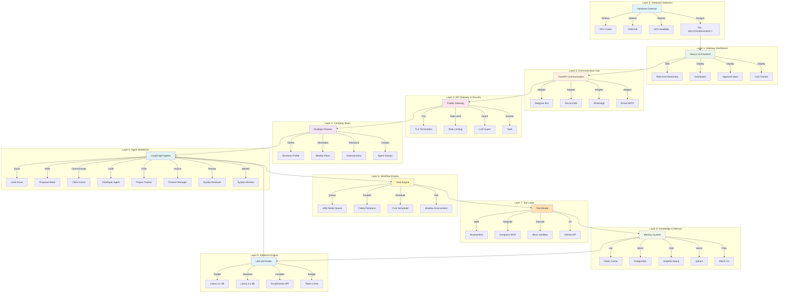
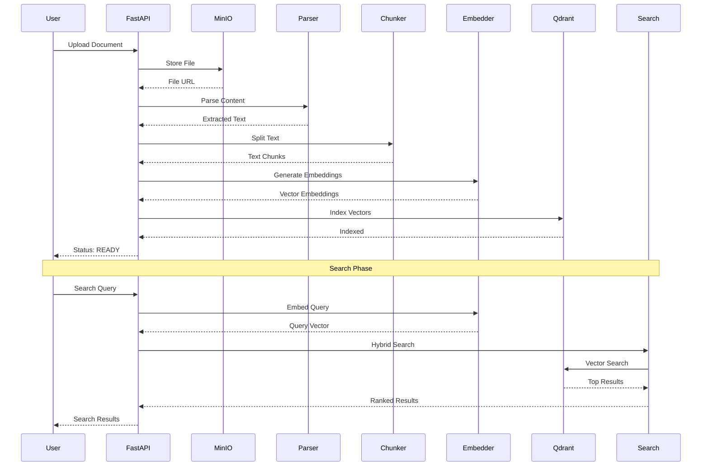
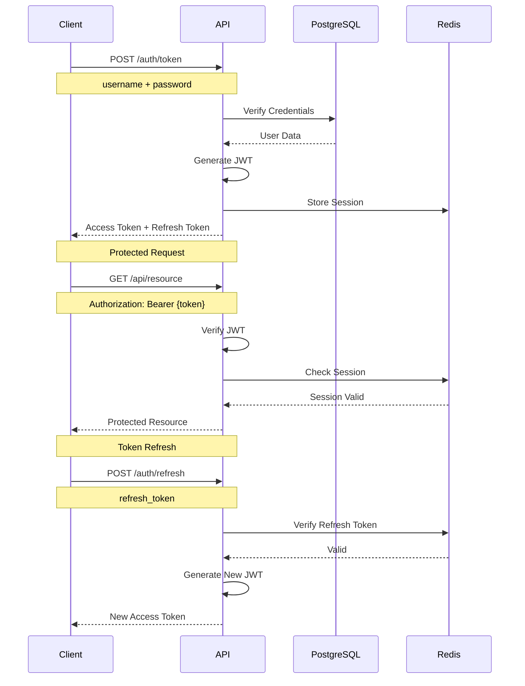
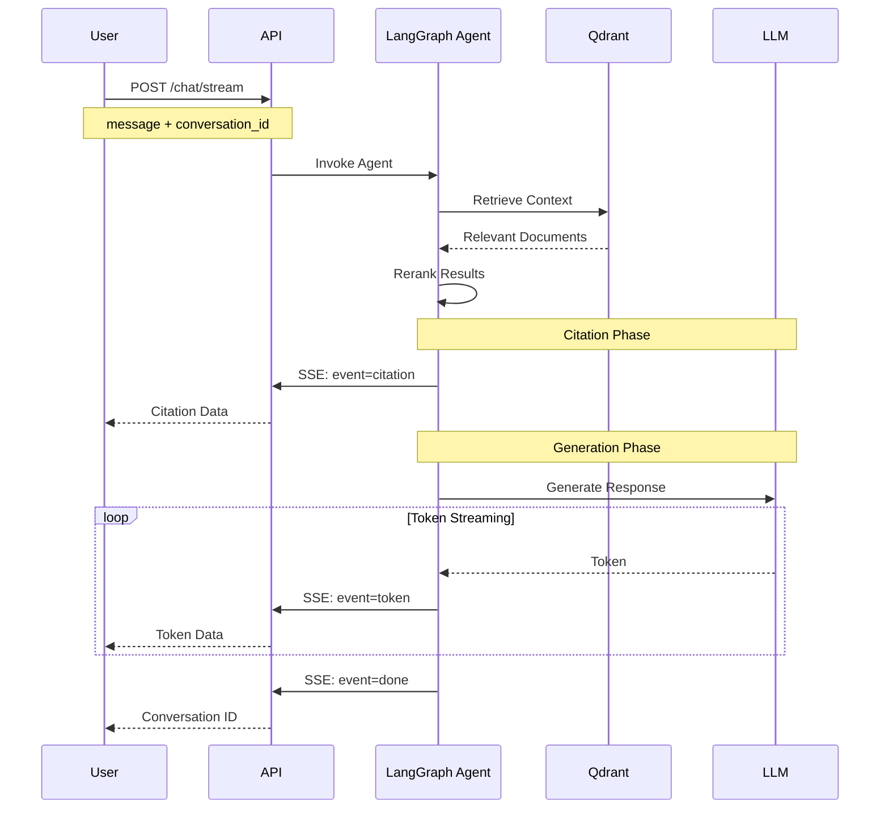
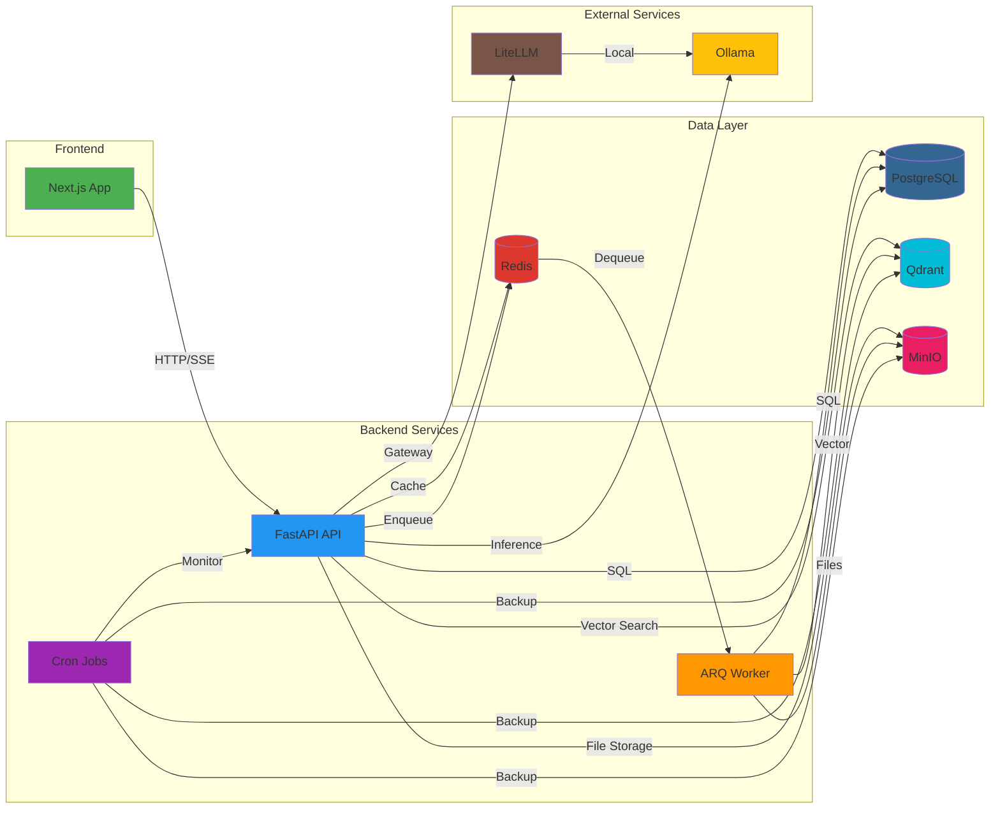
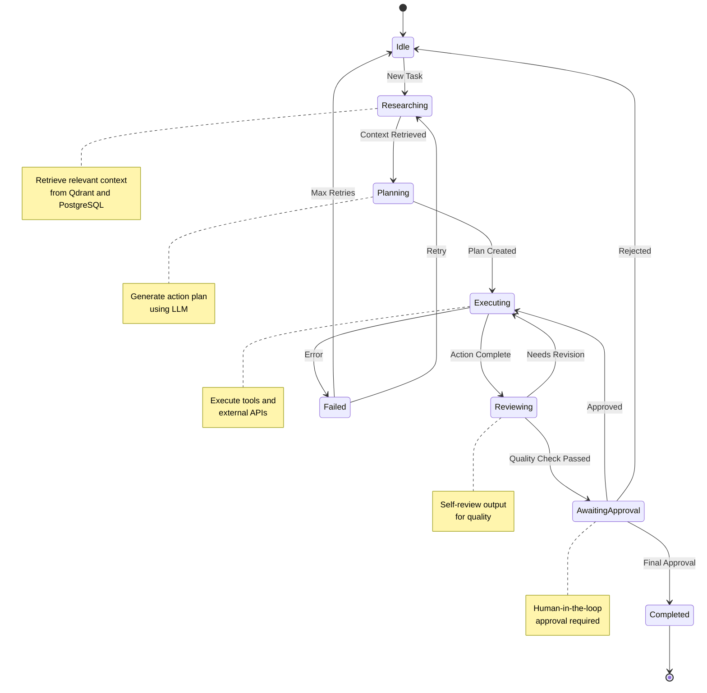
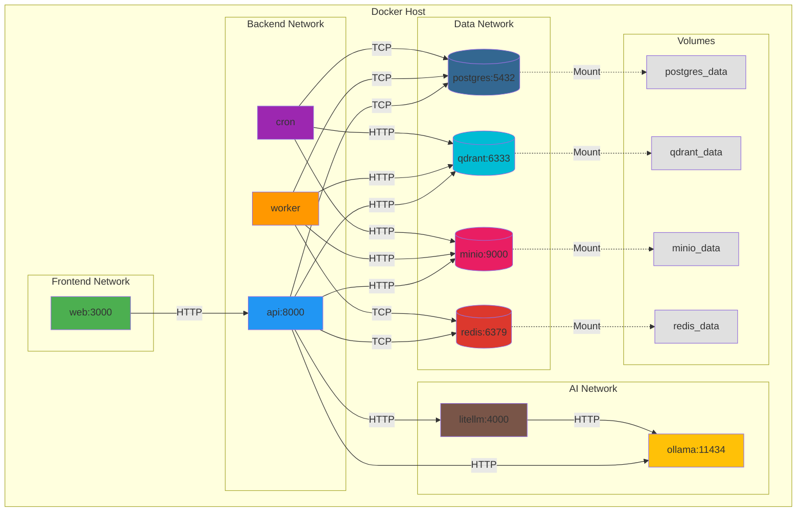

# Co-Op: Autonomous Company Operating System

**Co-Op** is a self-hosted AI platform that transforms your laptop or server into an autonomous business operator. Built with FastAPI, Next.js, and LangGraph, Co-Op automates lead generation, proposal writing, project management, and financial operations while keeping you in control through human-in-the-loop oversight.

[](https://github.com/NAVANEETHVVINOD/CO_OP/actions)
[](https://opensource.org/licenses/Apache-2.0)
[](https://www.python.org/downloads/)
[](https://nodejs.org/)

## Table of Contents

- [Overview](#overview)
- [Key Features](#key-features)
- [Quick Start](#quick-start)
- [Architecture](#architecture)
- [Technology Stack](#technology-stack)
- [Installation](#installation)
- [CLI Reference](#cli-reference)
- [Documentation](#documentation)
- [Security](#security)
- [Contributing](#contributing)
- [License](#license)

## Overview

Co-Op is an AI-native operating system designed to run an autonomous company. It integrates lead scouting, proposal writing, client communication, project tracking, and financial management into a seamless, high-performance platform. Everything runs locally with no cloud dependency and no hidden fees.

### What Co-Op Does

- **Lead Scout** - Searches Upwork, LinkedIn, and Fiverr every few hours, scores jobs against your profile
- **Proposal Writer** - Drafts personalized proposals using your portfolio with RAG (Retrieval-Augmented Generation)
- **Developer Agent** - Writes code, runs tests in a sandbox, pushes to GitHub
- **Client Communicator** - Handles professional conversations, escalates complex issues
- **Project Tracker** - Sets milestones, sends deadline reminders, tracks deliverables
- **Finance Manager** - Creates invoices from completed milestones, tracks payments
- **System Monitor** - Watches all services, attempts self-heal, sends alerts
- **Self-Improvement Analyst** - Reviews win/loss patterns, proposes improvements

### Why Co-Op

- **Self-Hosted** - Complete control over your data and infrastructure
- **Human-in-the-Loop** - All critical actions require your explicit approval
- **Scalable Architecture** - Grows from solo developer to agency with 4-stage design
- **Production-Ready** - Comprehensive test coverage, CI/CD, security hardening
- **Open Source** - Apache 2.0 license, community-driven development

## Key Features

### Autonomous Lead Generation

Co-Op's Lead Scout agent runs automated searches across multiple job platforms:
- Configurable search intervals (default: every 4 hours)
- AI-powered job scoring (0-10 scale) based on your profile
- Automatic filtering and ranking
- Real-time notifications via Telegram or dashboard

### Intelligent Proposal Writing

The Proposal Writer agent creates personalized, high-conversion proposals:
- RAG-enhanced content generation using your portfolio
- Self-review for quality, length, and client fit
- Company tone and success pattern matching
- Human approval workflow before submission

### Project Management Automation

Comprehensive project lifecycle management:
- Automatic milestone creation from proposals
- Deadline tracking with 72-hour advance reminders
- Weekly status report generation
- Client communication automation

### Financial Operations

Automated invoicing and payment tracking:
- Invoice generation from completed milestones
- Payment status monitoring
- Automatic reminder system (7-day intervals)
- Revenue tracking and reporting

### Code Delivery Pipeline

Full development workflow automation:
- Code generation using local or cloud LLMs
- Sandbox testing environment (Docker/microVM)
- Browser-based code review (VS Code)
- GitHub integration for delivery

### Human-in-the-Loop Control

Maintain oversight while automating operations:
- Approval required for all mutating actions
- Telegram slash commands for quick decisions
- Emergency stop functionality (`/panic`)
- Granular agent pause/resume controls

## Quick Start

### Prerequisites

- Docker with Docker Compose - [Install Docker](https://docs.docker.com/get-docker/)
- 4 GB RAM minimum (8 GB recommended for advanced features)
- Git
- Python 3.12+ (for CLI)
- Node.js 22+ (for frontend development)

### One-Command Installation

**Linux & macOS:**
```bash
curl -fsSL https://raw.githubusercontent.com/NAVANEETHVVINOD/CO_OP/main/install.sh | bash
```

**Windows (PowerShell):**
```powershell
Set-ExecutionPolicy Bypass -Scope Process -Force; iex ((New-Object System.Net.WebClient).DownloadString('https://raw.githubusercontent.com/NAVANEETHVVINOD/CO_OP/main/install.ps1'))
```

### Manual Installation

```bash
# Clone the repository
git clone https://github.com/NAVANEETHVVINOD/CO_OP.git
cd CO_OP

# Run installation script
./install.sh

# Start the system
coop gateway start
```

### Initial Setup

1. **Run the onboarding wizard:**
   ```bash
   coop onboard --install-daemon
   ```
   The wizard will:
   - Detect your hardware capabilities
   - Configure your business profile
   - Connect communication channels (Telegram, etc.)
   - Install background service (systemd/launchd)

2. **Access the dashboard:**
   Open [http://localhost:3000](http://localhost:3000)
   
   Default credentials:
   - Email: `admin@co-op.local`
   - Password: `testpass123`
   
   **Important:** Change these credentials after first login.

3. **Upload your portfolio:**
   Navigate to Documents section and upload your work samples. The RAG system will use these for proposal generation.

4. **Start earning:**
   - Lead Scout begins searching automatically
   - Review and approve proposals via Telegram or dashboard
   - Monitor project progress in real-time

## Architecture

Co-Op uses a 10-layer architecture designed for scalability and maintainability. The system follows a modular design where each layer has specific responsibilities and communicates through well-defined interfaces.

### System Architecture Diagram



### Data Flow: RAG Pipeline



### Authentication Flow



### Chat Streaming Flow



### Service Interaction Diagram



### Agent Workflow State Machine



### Docker Deployment Architecture



### Layer Descriptions

#### Layer 0: Hardware Detection
Automatically detects CPU, RAM, GPU, and KVM capabilities to assign appropriate tier (Solo / Team / Agency).

#### Layer 1: Gateway Dashboard
Next.js 15 application with:
- Dark theme UI with real-time updates
- Server-Sent Events (SSE) for streaming chat
- Agent activity monitoring
- Approval inbox and cost tracker

#### Layer 2: Communication Hub
FastAPI-based adapter layer supporting:
- Telegram Bot with slash commands
- Discord Bot integration
- WhatsApp Business API
- Email (SMTP) notifications
- Real-time thinking display

#### Layer 3: API Gateway & Security
- Traefik for TLS termination and rate limiting
- LLM Guard for prompt injection detection
- HashiCorp Vault for secrets management
- OPA for action authorization (Stage 4)

#### Layer 4: Company Brain
Strategic planning and research:
- Business profile and goals storage
- Weekly plan generation based on KPIs
- Research agent for continuous improvement
- Agent factory for dynamic agent creation

#### Layer 5: Agent Workforce
LangGraph-powered autonomous agents:
- Lead Scout (job discovery)
- Proposal Writer (content generation)
- Client Communicator (relationship management)
- Developer Agent (code delivery)
- Project Tracker (milestone management)
- Finance Manager (invoicing)
- Quality Reviewer (output validation)
- System Monitor (health checks)

#### Layer 6: Workflow & Task Engine
- ARQ (async Redis queue) for short parallel tasks
- Celery/Temporal for durable multi-day workflows
- Cron scheduler for system monitors and backups
- Shadow environment for safe testing

#### Layer 7: Internet & Tool Layer
Tool router with multiple executors:
- Browserless for web automation
- Composio MCP for 500+ integrations
- Micro-sandbox for code execution
- GitHub API for repository operations

#### Layer 8: Knowledge & Memory
Multi-tier storage architecture:
- **Hot (Redis)** - Session context and real-time data
- **Warm (PostgreSQL)** - Clients, proposals, results
- **Cold (Graphiti + Neo4j)** - Relationship patterns
- **Knowledge (Qdrant)** - Portfolio and templates (vector database)
- **Documents (MinIO)** - Files and deliverables (S3-compatible)

#### Layer 9: Inference Engine
LiteLLM-powered task routing:
- Simple tasks → Llama 3.2 3B (local, fast)
- Standard tasks → Llama 3.1 8B (local)
- Complex tasks → Groq/Gemini API (optional fallback)
- Budget enforcement with per-agent token limits

## Technology Stack

### Frontend
- **Next.js 16** - React framework with App Router
- **React 19** - UI library with Server Components
- **Tailwind CSS 4** - Utility-first CSS framework
- **shadcn/ui** - Accessible component library
- **TanStack Query** - Data fetching and caching
- **Zustand** - State management
- **TypeScript 5.7** - Type-safe development

### Backend
- **FastAPI 0.115** - High-performance async Python framework
- **SQLAlchemy 2.0** - Async ORM with PostgreSQL
- **LangGraph 0.2** - Agent state machine framework
- **LiteLLM 1.55** - Unified LLM gateway
- **Pydantic 2.10** - Data validation
- **Redis 7.4** - Caching and task queue
- **ARQ** - Async task processing

### Infrastructure
- **Docker Compose** - Container orchestration
- **PostgreSQL 17** - Primary database
- **Redis 7.4** - Cache and message broker
- **Qdrant 1.12** - Vector database for RAG
- **MinIO** - S3-compatible object storage
- **Traefik 3.2** - Reverse proxy and load balancer

### AI/ML
- **Ollama** - Local LLM inference
- **Sentence Transformers** - Text embeddings
- **LangChain** - LLM application framework
- **Hypothesis** - Property-based testing

### DevOps
- **GitHub Actions** - CI/CD pipeline
- **pytest** - Python testing framework
- **Vitest** - Frontend testing framework
- **Ruff** - Python linter and formatter
- **ESLint** - JavaScript/TypeScript linter

## Installation

### System Requirements

**Minimum:**
- 4 GB RAM
- 2 CPU cores
- 20 GB disk space
- Docker 24.0+

**Recommended:**
- 8 GB RAM
- 4 CPU cores
- 50 GB SSD
- GPU (optional, for faster local inference)

### Docker Installation

1. **Clone and setup:**
   ```bash
   git clone https://github.com/NAVANEETHVVINOD/CO_OP.git
   cd CO_OP
   cp .env.example .env
   ```

2. **Configure environment:**
   Edit `.env` file with your settings:
   ```bash
   # Database
   POSTGRES_PASSWORD=your_secure_password
   
   # API
   SECRET_KEY=your_secret_key_here
   
   # Optional: External LLM APIs
   # OPENAI_API_KEY=sk-...
   # ANTHROPIC_API_KEY=sk-ant-...
   ```

3. **Start services:**
   ```bash
   cd infrastructure/docker
   docker compose up -d
   ```

4. **Verify installation:**
   ```bash
   coop doctor
   ```

### Development Installation

For local development without Docker:

1. **Backend setup:**
   ```bash
   cd services/api
   python -m venv venv
   source venv/bin/activate  # On Windows: venv\Scripts\activate
   pip install -e ".[dev]"
   ```

2. **Frontend setup:**
   ```bash
   cd apps/web
   pnpm install
   pnpm dev
   ```

3. **CLI setup:**
   ```bash
   cd cli
   pip install -e .
   ```

## CLI Reference

The `coop` CLI is the primary management interface for Co-Op.

### Gateway Management

```bash
# Start all services
coop gateway start

# Stop all services
coop gateway stop

# Check service status
coop gateway status

# View service logs
coop gateway logs [service_name]
```

### System Operations

```bash
# Run comprehensive health check
coop doctor

# View system status
coop status

# Create system backup
coop backup create

# Restore from backup
coop backup restore <backup_id>
```

### Agent Management

```bash
# List all agents
coop agents list

# Pause specific agent
coop agents pause <agent_name>

# Resume specific agent
coop agents resume <agent_name>

# Pause all agents
coop agents pause --all
```

### Approval Workflow

```bash
# List pending approvals
coop approvals list

# Approve specific action
coop approve <approval_id>

# Approve multiple actions
coop approve <id1> <id2> <id3>

# Reject action
coop reject <approval_id>
```

### Emergency Controls

```bash
# Emergency stop (halt all agents)
coop panic

# Resume after panic
coop resume
```

### Testing

```bash
# Run end-to-end verification
coop test

# Run specific test suite
coop test --suite <suite_name>
```

## Documentation

Comprehensive documentation is available in the `docs/` directory:

- **[Installation Guide](docs/INSTALL.md)** - Detailed installation instructions
- **[User Guide](docs/USAGE.md)** - How to use Co-Op effectively
- **[Development Guide](docs/DEVELOPMENT.md)** - Contributing and extending Co-Op
- **[Architecture Blueprint](docs/CO_OP_SOLO_DEVELOPER_ARCHITECTURE.md)** - Complete system design
- **[API Reference](services/api/README.md)** - Backend API documentation
- **[Frontend Guide](apps/web/README.md)** - Frontend architecture and components
- **[Database Schema](docs/DATABASE.md)** - Database design and migrations
- **[Security Guide](docs/SECURITY.md)** - Security best practices
- **[Testing Guide](docs/TESTING.md)** - Testing strategy and examples
- **[Troubleshooting](docs/TROUBLESHOOTING.md)** - Common issues and solutions

## Security

Co-Op takes security seriously with multiple layers of protection:

### Authentication & Authorization
- JWT-based authentication with refresh tokens
- Role-based access control (RBAC)
- API key management for external integrations
- Session management with Redis

### Data Protection
- Encryption at rest for sensitive data
- TLS/SSL for all network communication
- Secrets management with HashiCorp Vault (Stage 3)
- Environment variable isolation

### Input Validation
- LLM Guard for prompt injection detection
- Pydantic validation for all API inputs
- SQL injection prevention with SQLAlchemy ORM
- XSS protection in frontend

### Network Security
- Traefik reverse proxy with rate limiting
- Docker network isolation
- Firewall-ready configuration
- CORS policy enforcement

### Monitoring & Auditing
- Comprehensive audit logging
- Real-time security alerts
- Automated vulnerability scanning
- Regular security updates

For detailed security information, see [SECURITY.md](docs/SECURITY.md).

## Contributing

We welcome contributions from the community! Whether you're fixing bugs, improving documentation, or adding new features, your help is appreciated.

### Getting Started

1. **Read the guidelines:**
   - [Contributing Guide](docs/CONTRIBUTING.md)
   - [Code of Conduct](docs/CODE_OF_CONDUCT.md)
   - [Development Guide](docs/DEVELOPMENT.md)

2. **Set up your environment:**
   ```bash
   git clone https://github.com/NAVANEETHVVINOD/CO_OP.git
   cd CO_OP
   ./install.sh
   ```

3. **Create a feature branch:**
   ```bash
   git checkout -b feature/your-feature-name
   ```

4. **Make your changes and test:**
   ```bash
   # Backend tests
   cd services/api
   pytest

   # Frontend tests
   cd apps/web
   pnpm test

   # CLI tests
   cd cli
   pytest
   ```

5. **Submit a pull request:**
   - Ensure all tests pass
   - Update documentation as needed
   - Follow the PR template

### Development Principles

Co-Op follows the "solo developer philosophy":
- Start simple, add complexity only when needed
- Prioritize working software over perfect architecture
- Document decisions and trade-offs
- Test critical paths thoroughly

### Areas for Contribution

- Bug fixes and performance improvements
- Documentation enhancements
- New agent capabilities
- Integration with additional platforms
- UI/UX improvements
- Test coverage expansion

## License

Co-Op is licensed under the Apache License 2.0. See [LICENSE](LICENSE) for details.

### Third-Party Licenses

Co-Op uses several open-source libraries. See [THIRD_PARTY_LICENSES.md](docs/THIRD_PARTY_LICENSES.md) for complete attribution.

## Acknowledgments

Co-Op is built on the shoulders of giants:

- **LangGraph** - Agent state machine framework
- **LiteLLM** - Unified LLM gateway
- **FastAPI** - High-performance Python framework
- **Next.js** - React framework for production
- **Qdrant** - Vector database for RAG
- **Browserless** - Headless Chrome automation

## Support

- **Documentation:** [docs/](docs/)
- **Issues:** [GitHub Issues](https://github.com/NAVANEETHVVINOD/CO_OP/issues)
- **Discussions:** [GitHub Discussions](https://github.com/NAVANEETHVVINOD/CO_OP/discussions)
- **Email:** support@co-op.ai

## Roadmap

See [ROADMAP.md](docs/ROADMAP.md) for planned features and improvements.

---

**Built with passion by developers, for developers.**

For questions, feedback, or contributions, please open an issue or start a discussion on GitHub.
