# Co-Op Frontend

Next.js 16 application with App Router, React 19, Tailwind CSS 4, and shadcn/ui components.

## Table of Contents

- [Overview](#overview)
- [Component Architecture](#component-architecture)
- [State Management](#state-management)
- [Styling & Design System](#styling--design-system)
- [Key Pages](#key-pages)
- [API Client](#api-client)
- [Environment Variables](#environment-variables)
- [Development](#development)
- [Testing](#testing)

## Overview

The Co-Op frontend is a production-ready Next.js application featuring:

- Next.js 16 App Router with React 19 Server Components
- Tailwind CSS 4 with dark theme design system
- shadcn/ui accessible component library
- Real-time chat with Server-Sent Events (SSE)
- TanStack Query v5 for data fetching and caching
- Zustand for client-side state management
- TypeScript 5.7 for type safety

### Technology Stack

- **Framework:** Next.js 16.1.4 with App Router
- **UI Library:** React 19.0.0 with Server Components
- **Styling:** Tailwind CSS 4.0.0 with custom design tokens
- **Components:** shadcn/ui (Radix UI primitives)
- **State:** Zustand 5.0.2 for global state
- **Data Fetching:** TanStack Query v5.62.11
- **Forms:** React Hook Form 7.54.2 with Zod validation
- **Icons:** Lucide React 0.468.0
- **Type Safety:** TypeScript 5.7.3

## Component Architecture

### Component Hierarchy Diagram

```mermaid
graph TD
    Layout[Root Layout] --> Dashboard[Dashboard Page]
    Layout --> Chat[Chat Page]
    Layout --> Documents[Documents Page]
    Layout --> Search[Search Page]
    Layout --> Agents[Agents Page]
    Layout --> Approvals[Approvals Page]
    Layout --> Admin[Admin Page]
    Layout --> Projects[Projects Page]
    Layout --> Finance[Finance Page]
    
    Dashboard --> StatusCard[StatusCard]
    Dashboard --> ActivityFeed[ActivityFeed]
    Dashboard --> QuickActions[QuickActions]
    
    Chat --> ChatInput[ChatInput]
    Chat --> MessageList[MessageList]
    Chat --> CitationPanel[CitationPanel]
    
    Documents --> DocumentList[DocumentList]
    Documents --> UploadButton[UploadButton]
    Documents --> DocumentStatus[DocumentStatus]
    
    Search --> SearchBar[SearchBar]
    Search --> ResultsList[ResultsList]
    
    Agents --> AgentCard[AgentCard]
    Agents --> AgentLogs[AgentLogs]
    
    Approvals --> ApprovalList[ApprovalList]
    Approvals --> ApprovalModal[ApprovalModal]
    
    Admin --> UserList[UserList]
    Admin --> SystemHealth[SystemHealth]
    
    Projects --> ProjectCard[ProjectCard]
    Projects --> MilestoneList[MilestoneList]
    
    Finance --> InvoiceList[InvoiceList]
    Finance --> CostTracker[CostTracker]
```



### Application Structure

```
apps/web/src/
├── app/                    # Next.js App Router pages
│   ├── (app)/             # Authenticated routes
│   │   ├── layout.tsx     # Auth layout with sidebar
│   │   ├── dashboard/     # Dashboard page
│   │   ├── chat/          # Chat interface
│   │   ├── documents/     # Document management
│   │   ├── search/        # Search interface
│   │   ├── agents/        # Agent monitoring
│   │   ├── approvals/     # HITL approval queue
│   │   ├── admin/         # Admin settings
│   │   ├── projects/      # Project management
│   │   └── finance/       # Financial tracking
│   ├── (auth)/            # Unauthenticated routes
│   │   ├── login/         # Login page
│   │   └── signup/        # Signup page
│   ├── layout.tsx         # Root layout
│   ├── page.tsx           # Landing page
│   └── globals.css        # Global styles
├── components/            # React components
│   ├── dashboard/         # Dashboard-specific components
│   ├── layout/            # Layout components (sidebar, topbar)
│   ├── shared/            # Shared components (StatusDot, MonoId, etc.)
│   └── ui/                # shadcn/ui components
├── hooks/                 # Custom React hooks
│   └── useChat.ts         # Chat SSE streaming hook
├── lib/                   # Utility libraries
│   ├── api.ts             # API client with fetch wrapper
│   ├── env.ts             # Environment variable validation
│   └── utils.ts           # Utility functions
├── store/                 # Zustand stores
│   └── chatStore.ts       # Chat state management
├── types/                 # TypeScript type definitions
│   └── api.ts             # API response types
└── __tests__/             # Test files
    ├── properties.test.ts # Property-based tests
    └── setup.ts           # Test configuration
```

## State Management

- **Zustand** - Global client state (theme, user preferences, notifications)
- **TanStack Query** - Server state (caching, background refetch)
- **React Context** - Theme and authentication context

## Styling & Design System

- **Tailwind CSS 4** - Utility-first CSS framework
- **shadcn/ui** - Accessible, customizable components (buttons, dialogs, tables, etc.)
- **Dark mode** - Fully supported, toggles via Zustand store

## Key Pages

### Dashboard (`/dashboard`)
- Displays system health indicators (API, database, Redis, MinIO, Qdrant).
- Shows recent activity feed.
- Provides quick action buttons.

### Chat (`/chat`)
- Real-time chat interface with SSE streaming.
- Displays citations inline with messages.
- Uses `useChat` hook for managing conversation state.

### Documents (`/documents`)
- Upload documents via drag-and-drop or file picker.
- View document list with status indicators (PENDING, INDEXING, READY, FAILED).
- Delete documents.

### Search (`/search`)
- Hybrid search across all indexed documents.
- Displays results with relevance scores.
- Filters by document type, date, etc.

### Agents (`/agents`)
- Monitor AI agent status and logs.
- View agent execution history.

### Approvals (`/approvals`)
- Human-in-the-loop (HITL) approval queue.
- Approve or reject actions (e.g., sending proposals, creating invoices).

### Admin (`/admin`)
- User management.
- System settings.
- Access control (admin only).

### Projects (`/projects`)
- Track active projects and milestones.
- View project timelines and deliverables.

### Finance (`/finance`)
- View invoices and payment status.
- Track costs and daily token usage vs budget.
- Fetches data from `/v1/costs` endpoint.

## API Client

The API client (`lib/api.ts`) provides typed functions for all backend endpoints. It automatically attaches authentication tokens from `localStorage` (or `httpOnly` cookies, depending on configuration).

```typescript
import { api } from '@/lib/api';

const conversations = await api.getConversations();
const doc = await api.uploadDocument(file);
```

## Environment Variables

| Variable | Description |
|----------|-------------|
| `NEXT_PUBLIC_API_URL` | Backend API URL (e.g., `http://localhost:8000`) |
| `NEXT_PUBLIC_WS_URL` | WebSocket URL for streaming (optional) |

## Development

```bash
# Install dependencies
pnpm install

# Start development server
pnpm dev

# Build for production
pnpm build

# Start production server
pnpm start

# Run linter
pnpm lint
```

## Testing

```bash
# Run all tests
pnpm test

# Run with coverage report
pnpm test:coverage
```

Tests use Vitest and Testing Library. See [TESTING.md](../../docs/TESTING.md) for details.

## Related Documentation

- [Backend API Documentation](../../services/api/README.md)
- [Database Schema](../../docs/DATABASE.md)
- [Testing Guide](../../docs/TESTING.md)
- [Contributing Guidelines](../../CONTRIBUTING.md)
