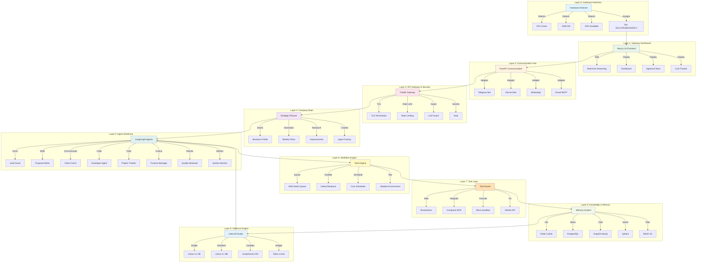
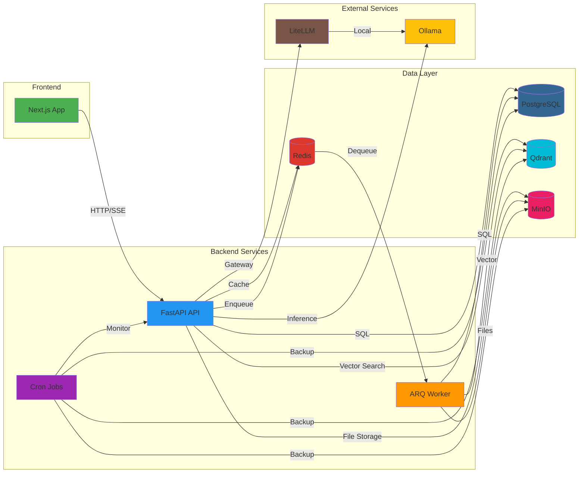
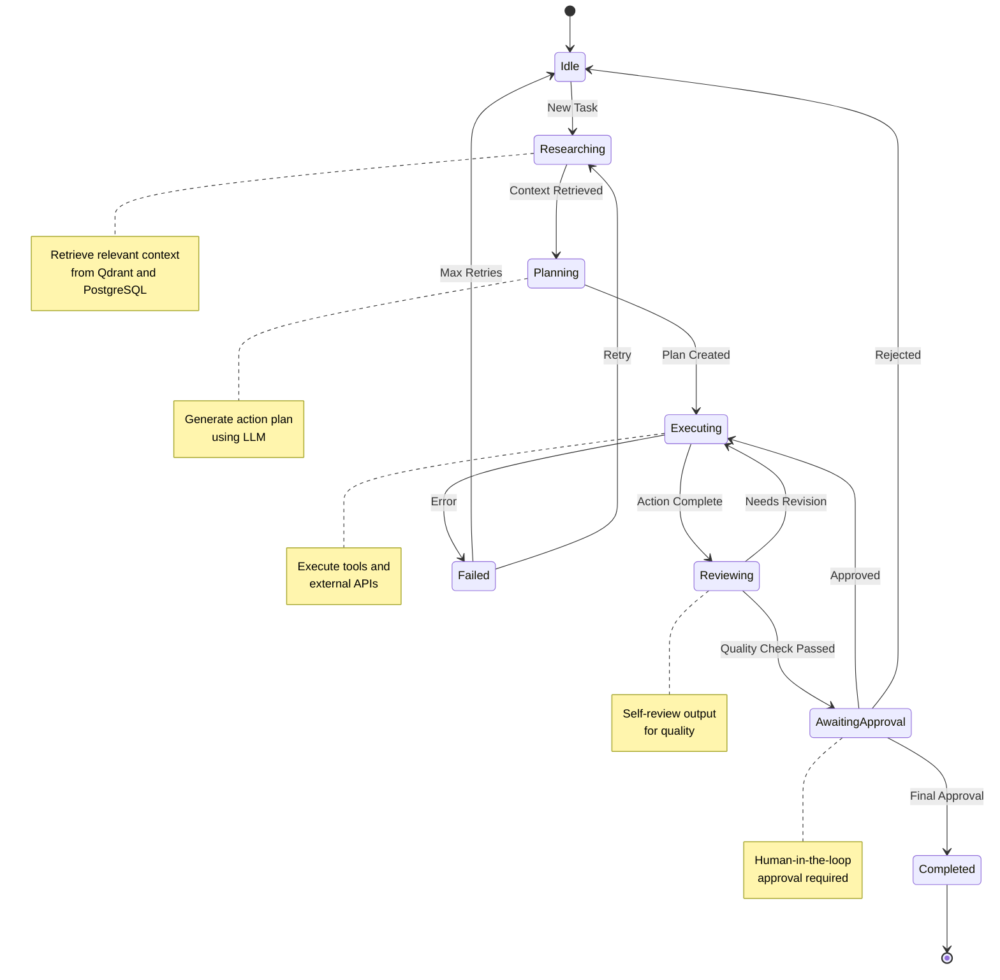
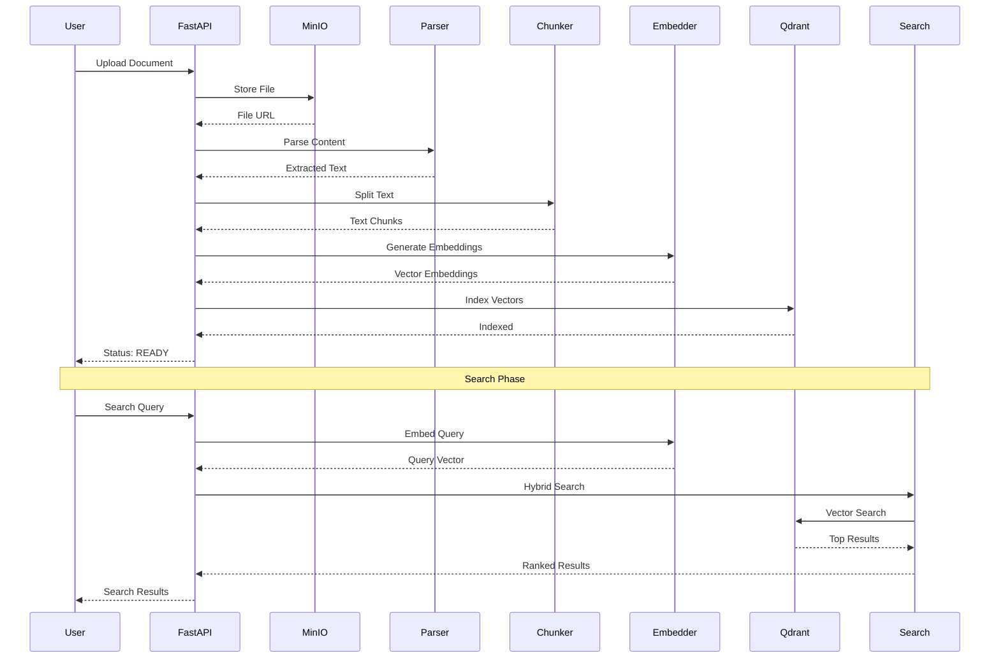
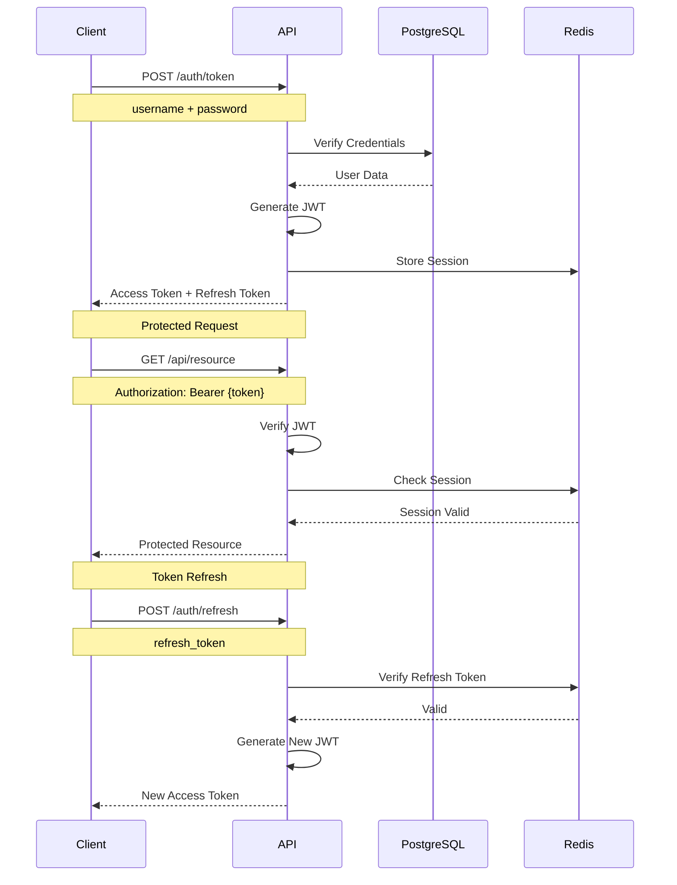
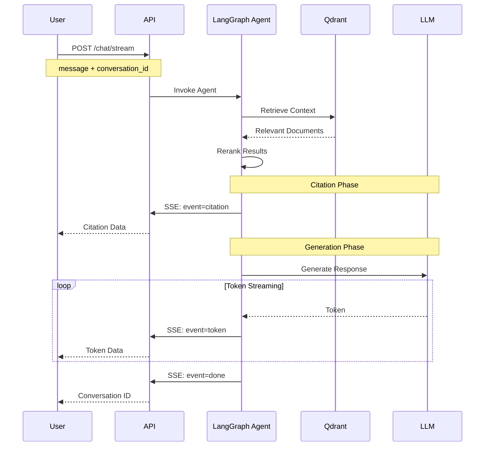
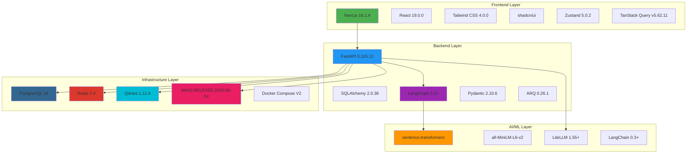

# Co-Op System Architecture

This document provides a comprehensive overview of the Co-Op system architecture, including the 10-layer design, component interactions, and data flows.

## Table of Contents

- [Overview](#overview)
- [10-Layer Architecture](#10-layer-architecture)
- [Component Interactions](#component-interactions)
- [Data Flow Patterns](#data-flow-patterns)
- [Technology Stack](#technology-stack)
- [Scalability Considerations](#scalability-considerations)

## Overview

Co-Op is built on a 10-layer architecture that separates concerns and enables independent scaling of different system components. Each layer has specific responsibilities and communicates through well-defined interfaces.

### Design Principles

- **Separation of Concerns** - Each layer handles a specific aspect of the system
- **Loose Coupling** - Layers communicate through interfaces, not direct dependencies
- **Scalability** - Each layer can scale independently based on load
- **Maintainability** - Clear boundaries make the system easier to understand and modify
- **Testability** - Isolated layers enable comprehensive unit and integration testing

## 10-Layer Architecture

### Complete System Diagram

### Layer 0: Hardware Detection

**Purpose:** Automatically detect system capabilities and assign appropriate tier.

**Components:**
- CPU core detection
- RAM capacity detection
- GPU availability check
- KVM virtualization support

**Tier Assignment:**
- **SOLO** (4GB RAM, 2 cores) - Single developer, local LLMs only
- **TEAM** (8GB RAM, 4 cores) - Small team, hybrid local/cloud LLMs
- **AGENCY** (16GB+ RAM, 8+ cores) - Full agency, all features enabled

### Layer 1: Gateway Dashboard

**Purpose:** Provide user interface for monitoring and control.

**Components:**
- Next.js 16 App Router with React 19
- Server-Sent Events (SSE) for real-time updates
- Dashboard with system health indicators
- Approval inbox for human-in-the-loop decisions
- Cost tracker for budget monitoring

**Key Features:**
- Dark theme UI with Tailwind CSS 4
- Real-time chat streaming
- Document management interface
- Agent activity monitoring

### Layer 2: Communication Hub

**Purpose:** Unified communication interface across multiple channels.

**Components:**
- Telegram Bot with slash commands
- Discord Bot integration
- WhatsApp Business API adapter
- Email (SMTP) notifications

**Communication Patterns:**
- Async message handling
- Real-time thinking display
- Approval request notifications
- Status update broadcasts

### Layer 3: API Gateway & Security

**Purpose:** Secure entry point with authentication, rate limiting, and threat protection.

**Components:**
- Traefik reverse proxy
- TLS termination
- Rate limiting
- LLM Guard for prompt injection detection
- HashiCorp Vault for secrets management

**Security Features:**
- JWT authentication
- Role-based access control (RBAC)
- API key management
- Request validation

### Layer 4: Company Brain

**Purpose:** Strategic planning and business intelligence.

**Components:**
- Business profile storage
- Weekly plan generator
- Research agent for continuous improvement
- Agent factory for dynamic agent creation

**Capabilities:**
- Goal tracking and KPI monitoring
- Win/loss pattern analysis
- Strategy optimization
- Agent configuration management

### Layer 5: Agent Workforce

**Purpose:** Autonomous agents for business operations.

**Agents:**
- **Lead Scout** - Job discovery and scoring
- **Proposal Writer** - Personalized proposal generation
- **Client Communicator** - Professional client interactions
- **Developer Agent** - Code generation and testing
- **Project Tracker** - Milestone and deadline management
- **Finance Manager** - Invoicing and payment tracking
- **Quality Reviewer** - Output validation
- **System Monitor** - Health checks and self-healing

**Agent Framework:**
- LangGraph state machines
- Human-in-the-loop approval workflow
- Self-review and quality checks
- Error handling and retry logic

### Layer 6: Workflow Engine

**Purpose:** Task orchestration and scheduling.

**Components:**
- ARQ (async Redis queue) for short tasks
- Celery/Temporal for durable workflows
- Cron scheduler for periodic tasks
- Shadow environment for safe testing

**Workflow Types:**
- Short parallel tasks (document indexing)
- Long-running workflows (proposal generation)
- Scheduled tasks (lead scouting, backups)
- Test workflows (shadow mode)

### Layer 7: Tool Layer

**Purpose:** External integrations and tool execution.

**Tools:**
- **Browserless** - Headless Chrome for web automation
- **Composio MCP** - 500+ API integrations
- **Micro-sandbox** - Isolated code execution
- **GitHub API** - Repository operations

**Tool Router:**
- Dynamic tool selection
- Error handling and retries
- Result validation
- Usage tracking

### Layer 8: Knowledge & Memory

**Purpose:** Multi-tier data storage and retrieval.

**Storage Tiers:**
- **Hot (Redis)** - Session context, real-time data (< 1ms latency)
- **Warm (PostgreSQL)** - Clients, proposals, results (< 10ms latency)
- **Cold (Graphiti + Neo4j)** - Relationship patterns (< 100ms latency)
- **Knowledge (Qdrant)** - Portfolio, templates (vector search)
- **Documents (MinIO)** - Files, deliverables (S3-compatible)

**Data Flow:**
- Write-through caching
- Lazy loading from cold storage
- Vector similarity search
- Full-text search

### Layer 9: Inference Engine

**Purpose:** LLM routing and budget management.

**LLM Router (LiteLLM):**
- **Simple tasks** → Llama 3.2 3B (local, fast, cheap)
- **Standard tasks** → Llama 3.1 8B (local, balanced)
- **Complex tasks** → Groq/Gemini API (cloud, powerful)

**Budget Enforcement:**
- Per-agent token limits
- Daily budget caps
- Cost tracking and alerts
- Automatic fallback to cheaper models

## Component Interactions

### Service Communication Diagram

### Agent Workflow State Machine

## Data Flow Patterns

### RAG Pipeline Flow

### Authentication Flow

### Chat Streaming Flow

## Technology Stack

### Technology Stack Visualization

### Component Versions

| Component | Version | Purpose |
|-----------|---------|---------|
| Next.js | 16.1.4 | Frontend framework with App Router |
| React | 19.0.0 | UI library with Server Components |
| Tailwind CSS | 4.0.0 | Utility-first CSS framework |
| FastAPI | 0.115.12 | Async Python web framework |
| SQLAlchemy | 2.0.36 | Async ORM for PostgreSQL |
| LangGraph | 0.2+ | Agent state machine framework |
| PostgreSQL | 16 | Primary relational database |
| Redis | 7.4 | Cache and message broker |
| Qdrant | 1.12.4 | Vector database for RAG |
| MinIO | 2024-06-04 | S3-compatible object storage |
| LiteLLM | 1.55+ | Unified LLM gateway |

## Scalability Considerations

### Horizontal Scaling

**Frontend (Next.js):**
- Stateless design enables multiple instances
- Load balancer distributes traffic
- CDN for static assets

**Backend (FastAPI):**
- Multiple API instances behind load balancer
- Shared Redis for session state
- Shared PostgreSQL for data persistence

**Workers (ARQ):**
- Multiple worker instances process queue
- Redis pub/sub for task distribution
- Automatic task retry on failure

### Vertical Scaling

**Database (PostgreSQL):**
- Increase RAM for larger working set
- Add CPU cores for parallel queries
- Use connection pooling (PgBouncer)

**Vector Database (Qdrant):**
- Increase RAM for in-memory index
- Add CPU cores for parallel search
- Use HNSW index for fast similarity search

**Object Storage (MinIO):**
- Add disk space for more documents
- Use erasure coding for redundancy
- Distribute across multiple drives

### Caching Strategy

**Redis Caching:**
- Session data (TTL: 7 days)
- API responses (TTL: 5 minutes)
- Search results (TTL: 1 hour)
- User preferences (TTL: 24 hours)

**Application Caching:**
- LRU cache for embeddings
- Query result cache
- Document metadata cache

### Performance Targets

| Operation | Target Latency | Notes |
|-----------|----------------|-------|
| Document upload | < 1s | Async processing |
| Search query | < 500ms | Hybrid search with reranking |
| Chat response (first token) | < 2s | Including retrieval |
| Chat response (full) | < 10s | Streaming tokens |
| Authentication | < 100ms | JWT validation |
| Health check | < 50ms | All services |

## Related Documentation

- [Main README](../README.md) - Project overview and quick start
- [Backend API Documentation](../services/api/README.md) - API reference
- [Frontend Documentation](../apps/web/README.md) - UI architecture
- [Docker Infrastructure](../infrastructure/docker/README.md) - Deployment guide
- [Database Schema](./DATABASE.md) - Data model
- [Security Guide](./SECURITY.md) - Security best practices
