# Diagram Style Guide

This document defines the visual standards for all diagrams in the Co-Op documentation. Consistent styling ensures diagrams are professional, readable, and maintainable.

## Table of Contents

- [Overview](#overview)
- [Color Scheme](#color-scheme)
- [Component Types](#component-types)
- [Diagram Types](#diagram-types)
- [Typography](#typography)
- [Layout Guidelines](#layout-guidelines)
- [Examples](#examples)

## Overview

All diagrams in Co-Op documentation use Mermaid syntax for GitHub rendering. This ensures diagrams are:
- Version-controlled as text
- Automatically rendered in GitHub
- Easy to update and maintain
- Accessible to screen readers

### Design Principles

1. **Consistency** - Use the same colors and styles across all diagrams
2. **Clarity** - Prioritize readability over complexity
3. **Simplicity** - Show only essential information
4. **Accessibility** - Use sufficient color contrast
5. **Professionalism** - Avoid decorative elements

## Color Scheme

### Primary Colors

Use these colors consistently across all diagrams:

| Component Type | Color | Hex Code | Usage |
|----------------|-------|----------|-------|
| Frontend | Green | `#4CAF50` | Next.js, React, UI components |
| Backend | Blue | `#2196F3` | FastAPI, API services |
| Data Storage | Various | See below | Databases, caches, storage |
| Workers | Orange | `#FF9800` | Background workers, cron jobs |
| AI/ML | Purple | `#9C27B0` | LangGraph agents, LLM services |
| Infrastructure | Brown | `#795548` | Docker, networking, system |

### Data Storage Colors

| Storage Type | Color | Hex Code |
|--------------|-------|----------|
| PostgreSQL | Dark Blue | `#336791` |
| Redis | Red | `#DC382D` |
| Qdrant | Cyan | `#00BCD4` |
| MinIO | Pink | `#E91E63` |
| Ollama | Amber | `#FFC107` |

### Background Colors (Pastel)

For layer groupings and subgraphs, use pastel versions:

| Layer | Color | Hex Code |
|-------|-------|----------|
| Hardware | Light Blue | `#E1F5FF` |
| Frontend | Light Green | `#E8F5E9` |
| Communication | Light Orange | `#FFF3E0` |
| Security | Light Pink | `#FCE4EC` |
| Brain | Light Purple | `#F3E5F5` |
| Agents | Light Teal | `#E0F2F1` |
| Workflow | Light Yellow | `#FFF9C4` |
| Tools | Light Orange | `#FFE0B2` |
| Memory | Light Lime | `#F1F8E9` |
| Inference | Light Blue | `#E3F2FD` |

### Neutral Colors

| Element | Color | Hex Code | Usage |
|---------|-------|----------|-------|
| Volumes | Light Gray | `#E0E0E0` | Docker volumes, persistent storage |
| External | Very Light Blue | `#E3F2FD` | External services, users |
| Network | Light Amber | `#FFF3E0` | Network boundaries, DMZ |

## Component Types

### Service Nodes

**Syntax:**
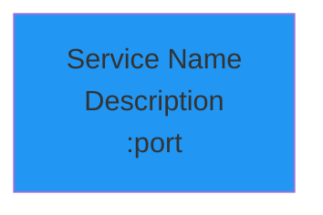

**Guidelines:**
- Use square brackets `[]` for services
- Include service name, brief description, and port
- Use ` ` for line breaks
- Apply appropriate color based on component type

### Database Nodes

**Syntax:**
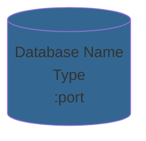

**Guidelines:**
- Use cylinder shape `[()]` for databases
- Include database name, type, and port
- Use database-specific colors

### Subgraphs (Layers)

**Syntax:**
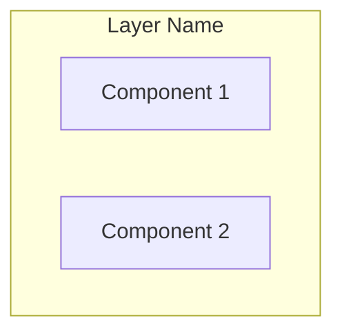

**Guidelines:**
- Use descriptive layer names
- Group related components
- Use pastel background colors for layers
- Avoid nesting subgraphs more than 2 levels deep

### Connections

**Arrow Types:**
- `-->` Solid arrow (primary data flow)
- `-.->` Dotted arrow (secondary/optional flow)
- `==>` Thick arrow (high-volume data flow)

**Labels:**
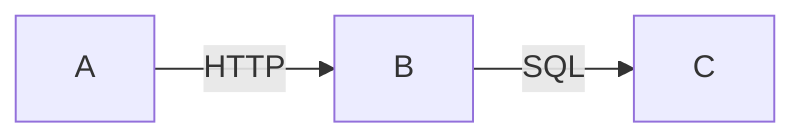

**Guidelines:**
- Label connections with protocol or data type
- Keep labels short (HTTP, SQL, TCP, S3)
- Use consistent terminology

## Diagram Types

### 1. Architecture Diagrams

**Purpose:** Show system structure and component relationships

**Style:**
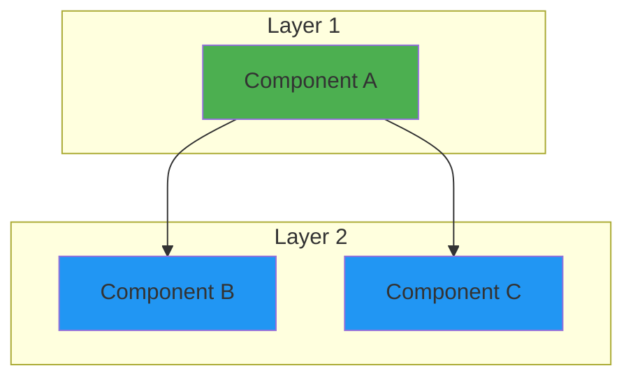

**Guidelines:**
- Use top-to-bottom (`TB`) or left-to-right (`LR`) layout
- Group components into layers using subgraphs
- Show clear data flow direction
- Apply consistent colors

### 2. Sequence Diagrams

**Purpose:** Show interactions over time

**Style:**
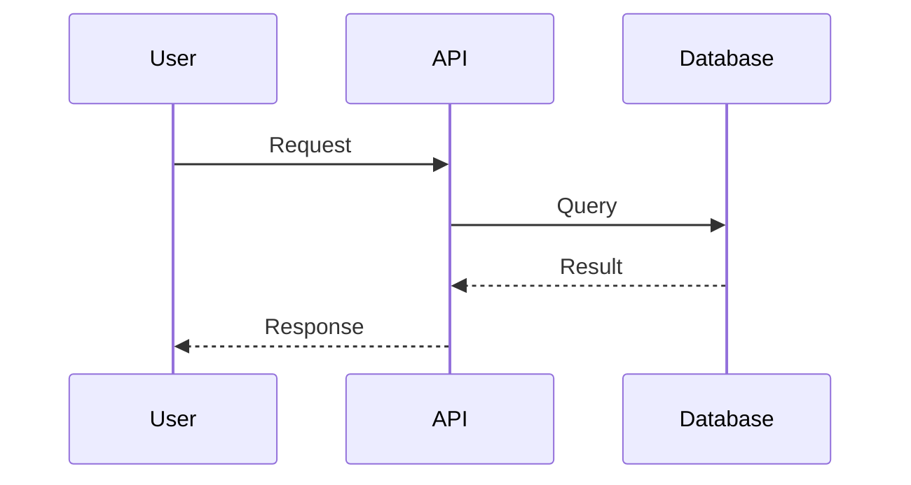

**Guidelines:**
- Use descriptive participant names
- Use aliases for long names (`DB as Database`)
- Use solid arrows (`->>`) for requests
- Use dashed arrows (`-->>`) for responses
- Add notes for clarification

### 3. State Diagrams

**Purpose:** Show state transitions

**Style:**
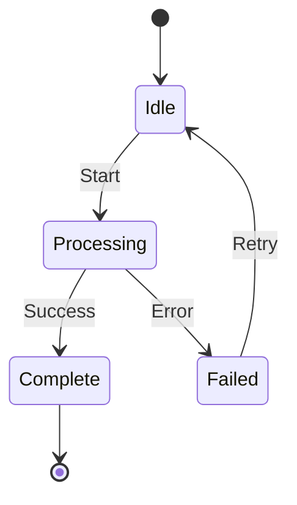

**Guidelines:**
- Use clear state names
- Label transitions with trigger events
- Show error paths
- Include start and end states

### 4. Deployment Diagrams

**Purpose:** Show infrastructure and deployment architecture

**Style:**
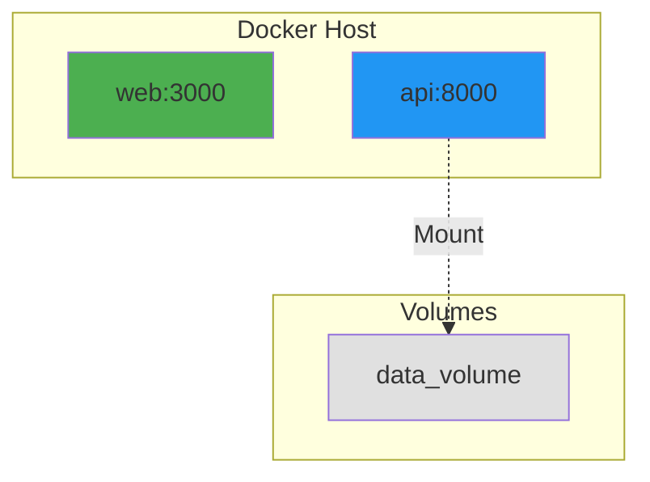

**Guidelines:**
- Show containers, networks, and volumes
- Use dotted lines for volume mounts
- Include port mappings
- Show network boundaries

## Typography

### Text Formatting

**Component Names:**
- Use Title Case for service names: `FastAPI API`
- Use lowercase for technical terms: `postgres`, `redis`
- Use version numbers when relevant: `Next.js 16`

**Descriptions:**
- Keep descriptions brief (1-3 words)
- Use common abbreviations: `API`, `DB`, `S3`
- Include ports: `:8000`, `:5432`

**Labels:**
- Use UPPERCASE for protocols: `HTTP`, `SQL`, `TCP`
- Use lowercase for actions: `query`, `store`, `fetch`

### Line Breaks

Use ` ` for multi-line text in nodes:

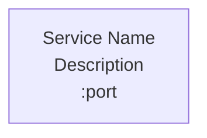

**Guidelines:**
- Line 1: Service name
- Line 2: Brief description or type
- Line 3: Port number (if applicable)

## Layout Guidelines

### Diagram Size

- **Small diagrams** (< 10 nodes): Use simple layout, minimal subgraphs
- **Medium diagrams** (10-30 nodes): Use subgraphs for grouping
- **Large diagrams** (> 30 nodes): Split into multiple diagrams

### Direction

- **Top-to-Bottom (`TB`)**: For layered architectures, data pipelines
- **Left-to-Right (`LR`)**: For workflows, sequences
- **Bottom-to-Top (`BT`)**: Rarely used
- **Right-to-Left (`RL`)**: Rarely used

### Spacing

- Leave space between subgraphs
- Avoid crossing arrows when possible
- Group related components together
- Use consistent node sizes

### Alignment

- Align nodes horizontally within layers
- Align subgraphs vertically
- Keep connection lines straight when possible

## Examples

### Example 1: Simple Service Diagram

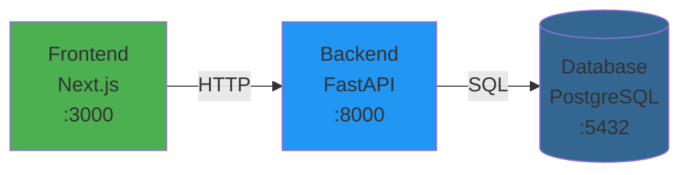

### Example 2: Layered Architecture

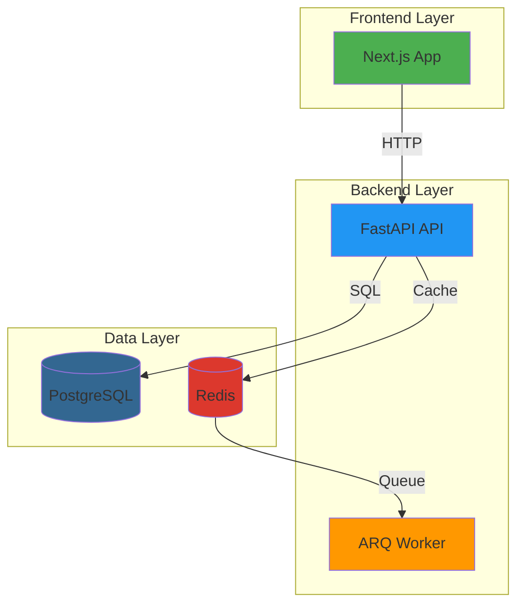

### Example 3: Sequence Diagram

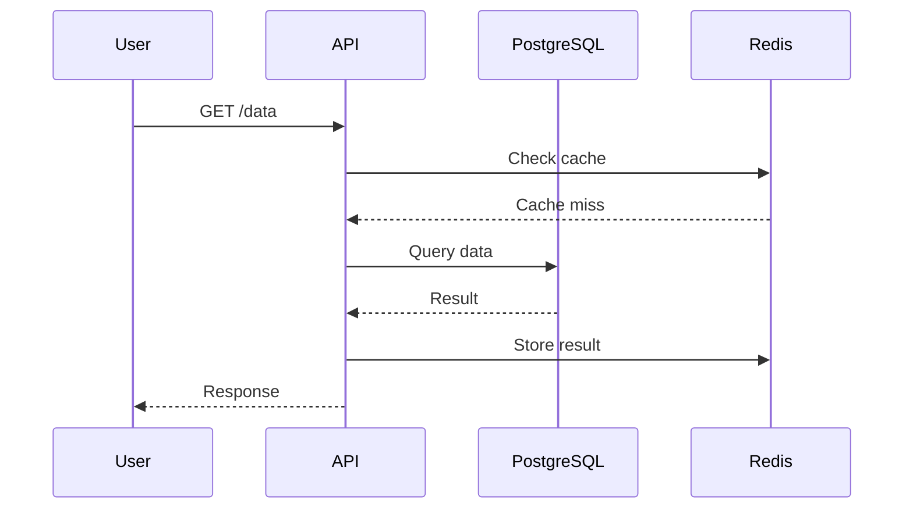

### Example 4: State Machine

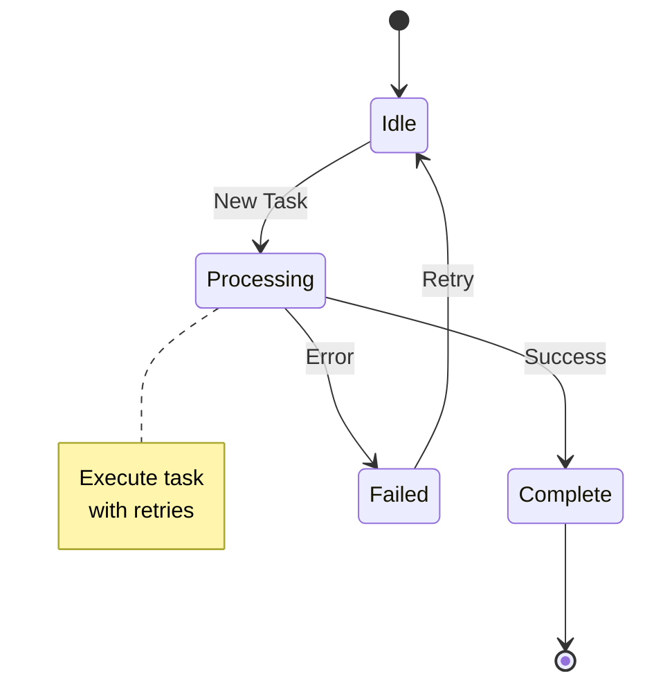

## Mermaid Syntax Reference

### Basic Graph

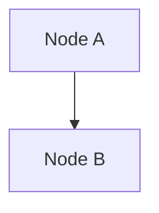

### Styled Graph

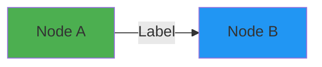

### Subgraph

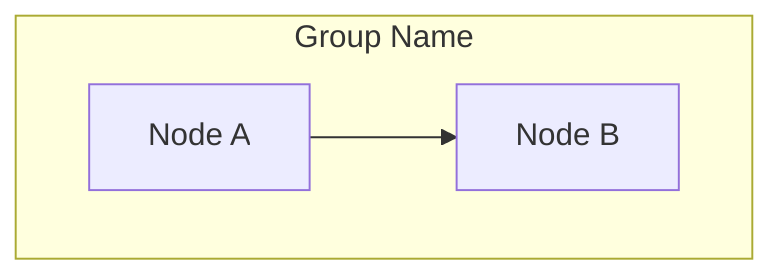

### Sequence Diagram

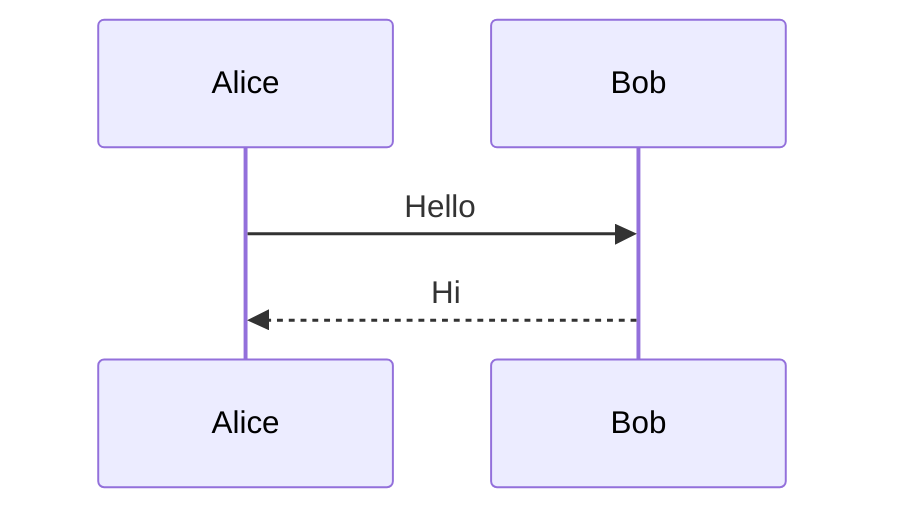

### State Diagram

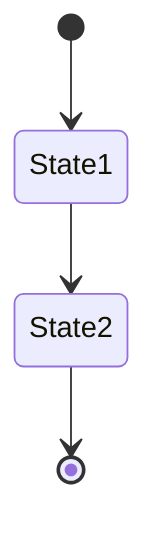

## Best Practices

### Do's

- Use consistent colors across all diagrams
- Keep diagrams simple and focused
- Label all connections
- Use subgraphs for logical grouping
- Include legends when using custom symbols
- Test diagrams render correctly in GitHub
- Use descriptive names for components

### Don'ts

- Don't use too many colors (stick to the palette)
- Don't create overly complex diagrams (split if needed)
- Don't use decorative elements
- Don't mix diagram types unnecessarily
- Don't use ambiguous labels
- Don't forget to style nodes
- Don't use emoji or special characters

## Validation

Before committing diagrams, verify:

1. **Rendering** - Diagram renders correctly in GitHub
2. **Colors** - All nodes use colors from the style guide
3. **Labels** - All connections are labeled
4. **Readability** - Diagram is clear at different zoom levels
5. **Consistency** - Style matches other diagrams in documentation
6. **Accessibility** - Sufficient color contrast for readability

## Tools

### Mermaid Live Editor

Test diagrams before committing:
- https://mermaid.live/

### Color Picker

Verify colors match the style guide:
- Use hex codes from the color scheme tables
- Test contrast ratios for accessibility

## Maintenance

### Updating Diagrams

When updating diagrams:
1. Maintain existing color scheme
2. Keep layout consistent with original
3. Update all related diagrams if structure changes
4. Test rendering in GitHub
5. Update this style guide if new patterns emerge

### Adding New Diagram Types

If adding a new diagram type:
1. Document the purpose and use case
2. Provide a style example
3. Define color usage
4. Add to this style guide
5. Update related documentation

## Related Documentation

- [Architecture Guide](./ARCHITECTURE.md) - System architecture diagrams
- [Deployment Guide](./DEPLOYMENT.md) - Deployment architecture diagrams
- [Backend API Documentation](../services/api/README.md) - API flow diagrams
- [Frontend Documentation](../apps/web/README.md) - Component hierarchy diagrams
- [Docker Infrastructure](../infrastructure/docker/README.md) - Infrastructure diagrams
