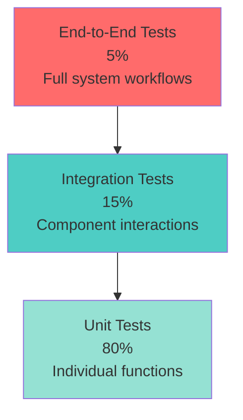

# Testing Guide

Comprehensive testing guide for Co-Op Enterprise AI OS covering unit tests, integration tests, property-based tests, and end-to-end testing strategies.

## Table of Contents

- [Overview](#overview)
- [Testing Philosophy](#testing-philosophy)
- [Testing Pyramid](#testing-pyramid)
- [Backend Testing](#backend-testing)
- [Frontend Testing](#frontend-testing)
- [CLI Testing](#cli-testing)
- [Property-Based Testing](#property-based-testing)
- [Integration Testing](#integration-testing)
- [Running Tests](#running-tests)
- [Coverage Requirements](#coverage-requirements)
- [Best Practices](#best-practices)
- [Common Patterns](#common-patterns)
- [Troubleshooting](#troubleshooting)

## Overview

Co-Op uses a comprehensive testing strategy to ensure reliability and maintainability:

- **Backend**: pytest with async support, SQLite in-memory database, mocked external services
- **Frontend**: Vitest with Testing Library, MSW for API mocking, jsdom environment
- **CLI**: pytest with subprocess testing, mocked Docker commands
- **Property-Based**: Hypothesis (Python) and fast-check (TypeScript) for invariant testing

### Test Coverage Targets

| Component | Target | Current | Status |
|-----------|--------|---------|--------|
| Backend | 80% | 74% | In Progress |
| Frontend | 70% | 70% | Met |
| CLI | 75% | 75% | Met |

## Testing Philosophy

### Core Principles

1. **Test Behavior, Not Implementation** - Focus on what the code does, not how it does it
2. **Isolation** - Each test should be independent and not rely on other tests
3. **Fast Feedback** - Tests should run quickly to enable rapid development
4. **Realistic Scenarios** - Tests should reflect real-world usage patterns
5. **Maintainability** - Tests should be easy to understand and update

### What to Test

- **Critical Paths**: Authentication, data persistence, API endpoints
- **Edge Cases**: Empty inputs, boundary values, error conditions
- **Business Logic**: RAG pipeline, search algorithms, agent workflows
- **User Interactions**: Form submissions, navigation, real-time updates
- **Integration Points**: Database queries, external API calls, file operations

### What Not to Test

- **Third-Party Libraries**: Trust that well-maintained libraries work correctly
- **Framework Internals**: Don't test FastAPI, React, or Next.js behavior
- **Trivial Code**: Simple getters/setters, pass-through functions
- **Generated Code**: Auto-generated migrations, type definitions

## Testing Pyramid



### Test Distribution

- **Unit Tests (80%)**: Fast, isolated tests of individual functions and classes
- **Integration Tests (15%)**: Test interactions between components (API + database, frontend + API)
- **End-to-End Tests (5%)**: Full system tests simulating real user workflows

## Backend Testing

### Technology Stack

- **pytest 8.3.4**: Test framework with async support
- **pytest-asyncio**: Async test fixtures and markers
- **pytest-cov**: Coverage reporting
- **httpx**: Async HTTP client for API testing
- **SQLAlchemy**: In-memory SQLite database for test isolation
- **Hypothesis**: Property-based testing library

### Test Structure

```
services/api/tests/
├── conftest.py                    # Shared fixtures and configuration
├── test_properties.py             # Property-based tests
├── test_auth.py                   # Authentication tests
├── test_auth_flow.py              # Auth integration tests
├── test_chat.py                   # Chat endpoint tests
├── test_conversations.py          # Conversation management tests
├── test_documents_enhanced.py     # Document upload/management tests
├── test_search.py                 # Search functionality tests
├── test_health.py                 # Health check tests
├── test_approvals.py              # HITL approval tests
├── test_credits_enhanced.py       # Cost tracking tests
├── test_settings_enhanced.py      # Settings management tests
├── test_indexer_enhanced.py       # Document indexing tests
├── test_system_monitor_enhanced.py # System monitoring tests
├── test_minio_client.py           # MinIO integration tests
└── test_integration.py            # End-to-end integration tests
```

### Test Configuration

The `conftest.py` file provides shared fixtures and configuration:

```python
# Key fixtures available in all tests:
# - db_session: Async SQLAlchemy session with SQLite in-memory database
# - async_client: HTTPX async client for API testing
# - cleanup_db: Automatic database cleanup between tests

# External services are mocked:
# - sentence_transformers: Mocked embeddings
# - Redis: Mocked async Redis client
# - Qdrant: Mocked vector database
# - MinIO: Mocked S3-compatible storage
```

### Writing Backend Tests

#### Unit Test Example

```python
import pytest
from httpx import AsyncClient

@pytest.mark.asyncio
async def test_login_success(async_client: AsyncClient):
    """Test successful login with valid credentials."""
    response = await async_client.post(
        "/v1/auth/token",
        data={
            "username": "admin@co-op.local",
            "password": "testpass123"
        }
    )
    assert response.status_code == 200
    data = response.json()
    assert "access_token" in data
    assert "refresh_token" in data
    assert data["token_type"] == "bearer"
```

#### Integration Test Example

```python
@pytest.mark.asyncio
async def test_document_upload_and_search(async_client: AsyncClient, db_session):
    """Test complete document workflow: upload -> index -> search."""
    # 1. Upload document
    files = {"file": ("test.txt", b"Test content", "text/plain")}
    response = await async_client.post("/v1/documents", files=files)
    assert response.status_code == 201
    doc_id = response.json()["id"]
    
    # 2. Wait for indexing (in real tests, mock the indexer)
    # ... indexing logic ...
    
    # 3. Search for content
    response = await async_client.get("/v1/search?q=test")
    assert response.status_code == 200
    results = response.json()
    assert len(results) > 0
    assert results[0]["document_id"] == doc_id
```

### Testing Async Code

All async tests must use the `@pytest.mark.asyncio` decorator:

```python
@pytest.mark.asyncio
async def test_async_function():
    result = await some_async_function()
    assert result == expected_value
```

### Mocking External Services

External services are mocked in `conftest.py` to ensure test isolation:

```python
# Qdrant is mocked to return empty results
mock_qdrant = MagicMock()
mock_qdrant.search = AsyncMock(return_value=[])
mock_qdrant.query_points = AsyncMock(return_value=MagicMock(points=[]))

# Redis is mocked to prevent connection attempts
redis.asyncio.from_url = mock_from_url

# MinIO is mocked for file operations
minio.Minio = MagicMock()
```

### Testing Database Operations

Use the `db_session` fixture for database tests:

```python
@pytest.mark.asyncio
async def test_create_user(db_session):
    from app.db.models import User
    from sqlalchemy import select
    
    # Create user
    user = User(email="test@example.com", hashed_password="hash")
    db_session.add(user)
    await db_session.commit()
    
    # Verify user exists
    result = await db_session.execute(select(User).where(User.email == "test@example.com"))
    found_user = result.scalar_one_or_none()
    assert found_user is not None
    assert found_user.email == "test@example.com"
```

### Testing API Endpoints

Use the `async_client` fixture for endpoint tests:

```python
@pytest.mark.asyncio
async def test_get_conversations(async_client: AsyncClient):
    """Test retrieving user conversations."""
    # First, login to get token
    login_response = await async_client.post(
        "/v1/auth/token",
        data={"username": "admin@co-op.local", "password": "testpass123"}
    )
    token = login_response.json()["access_token"]
    
    # Make authenticated request
    response = await async_client.get(
        "/v1/conversations",
        headers={"Authorization": f"Bearer {token}"}
    )
    assert response.status_code == 200
    assert isinstance(response.json(), list)
```

## Frontend Testing

### Technology Stack

- **Vitest 1.2.0**: Fast test runner with ESM support
- **Testing Library**: React component testing utilities
- **jsdom**: Browser environment simulation
- **MSW (Mock Service Worker)**: API mocking
- **fast-check**: Property-based testing

### Test Structure

```
apps/web/src/__tests__/
├── setup.ts                       # Test configuration and global mocks
├── properties.test.ts             # Property-based tests
├── components/
│   ├── StatusDot.test.tsx         # Shared component tests
│   ├── MonoId.test.tsx
│   ├── EmptyState.test.tsx
│   ├── StatusBadge.test.tsx
│   └── PageHeader.test.tsx
├── pages/
│   ├── dashboard.test.tsx         # Page integration tests
│   ├── chat.test.tsx
│   └── documents.test.tsx
├── lib/
│   └── api.test.ts                # API client tests
├── hooks/
│   └── useChat.test.ts            # Custom hook tests
└── mocks/
    ├── server.ts                  # MSW server setup
    └── handlers.ts                # API mock handlers
```

### Vitest Configuration

```typescript
// vitest.config.ts
import { defineConfig } from 'vitest/config';
import react from '@vitejs/plugin-react';
import path from 'path';

export default defineConfig({
  plugins: [react()],
  test: {
    globals: true,
    environment: 'jsdom',
    coverage: {
      provider: 'v8',
      reporter: ['text', 'html', 'lcov'],
      thresholds: {
        lines: 70,
        functions: 70,
        branches: 70,
        statements: 70
      }
    },
    setupFiles: ['./src/__tests__/setup.ts']
  },
  resolve: {
    alias: {
      '@': path.resolve(__dirname, './src')
    }
  }
});
```

### Writing Frontend Tests

#### Component Test Example

```typescript
import { render, screen } from '@testing-library/react';
import { describe, it, expect } from 'vitest';
import { StatusDot } from '@/components/shared/StatusDot';

describe('StatusDot', () => {
  it('renders success status with green color', () => {
    render(<StatusDot status="success" />);
    const dot = screen.getByRole('status');
    expect(dot).toHaveClass('bg-green-500');
  });

  it('renders error status with red color', () => {
    render(<StatusDot status="error" />);
    const dot = screen.getByRole('status');
    expect(dot).toHaveClass('bg-red-500');
  });

  it('renders with custom label', () => {
    render(<StatusDot status="success" label="Active" />);
    expect(screen.getByText('Active')).toBeInTheDocument();
  });
});
```

#### User Interaction Test Example

```typescript
import { render, screen, fireEvent, waitFor } from '@testing-library/react';
import { describe, it, expect, vi } from 'vitest';
import { ChatInput } from '@/components/chat/ChatInput';

describe('ChatInput', () => {
  it('submits message on enter key', async () => {
    const onSubmit = vi.fn();
    render(<ChatInput onSubmit={onSubmit} />);
    
    const input = screen.getByPlaceholderText('Type a message...');
    fireEvent.change(input, { target: { value: 'Hello' } });
    fireEvent.keyDown(input, { key: 'Enter', code: 'Enter' });
    
    await waitFor(() => {
      expect(onSubmit).toHaveBeenCalledWith('Hello');
    });
  });

  it('does not submit empty message', () => {
    const onSubmit = vi.fn();
    render(<ChatInput onSubmit={onSubmit} />);
    
    const input = screen.getByPlaceholderText('Type a message...');
    fireEvent.keyDown(input, { key: 'Enter', code: 'Enter' });
    
    expect(onSubmit).not.toHaveBeenCalled();
  });
});
```

#### API Mocking with MSW

```typescript
// src/__tests__/mocks/handlers.ts
import { http, HttpResponse } from 'msw';

export const handlers = [
  http.get('http://localhost:8000/v1/conversations', () => {
    return HttpResponse.json([
      { id: '1', title: 'Test Conversation', created_at: '2024-01-01' }
    ]);
  }),

  http.post('http://localhost:8000/v1/auth/token', async ({ request }) => {
    const body = await request.formData();
    const username = body.get('username');
    
    if (username === 'admin@co-op.local') {
      return HttpResponse.json({
        access_token: 'mock-token',
        refresh_token: 'mock-refresh',
        token_type: 'bearer'
      });
    }
    
    return HttpResponse.json(
      { detail: 'Invalid credentials' },
      { status: 401 }
    );
  })
];
```

### Testing Custom Hooks

```typescript
import { renderHook, waitFor } from '@testing-library/react';
import { describe, it, expect } from 'vitest';
import { useChat } from '@/hooks/useChat';

describe('useChat', () => {
  it('initializes with empty messages', () => {
    const { result } = renderHook(() => useChat());
    expect(result.current.messages).toEqual([]);
  });

  it('adds message when sendMessage is called', async () => {
    const { result } = renderHook(() => useChat());
    
    result.current.sendMessage('Hello');
    
    await waitFor(() => {
      expect(result.current.messages).toHaveLength(1);
      expect(result.current.messages[0].content).toBe('Hello');
    });
  });
});
```

## CLI Testing

### Technology Stack

- **pytest**: Test framework
- **subprocess**: CLI command execution
- **monkeypatch**: Environment variable mocking

### Test Structure

```
cli/tests/
├── test_cli.py                    # Main CLI tests
├── test_gateway.py                # Gateway command tests
├── test_doctor.py                 # Doctor command tests
├── test_backup.py                 # Backup command tests
└── conftest.py                    # CLI test fixtures
```

### Writing CLI Tests

#### Command Execution Test

```python
import subprocess
import sys
from pathlib import Path

def run_coop(args):
    """Run coop CLI as a subprocess."""
    return subprocess.run(
        [sys.executable, "-m", "coop.main"] + args,
        capture_output=True,
        text=True
    )

def test_cli_help():
    """Test CLI help command."""
    result = run_coop(["--help"])
    assert result.returncode == 0
    assert "Co-Op Autonomous Company OS" in result.stdout

def test_gateway_status():
    """Test gateway status command."""
    result = run_coop(["gateway", "status"])
    assert "Gateway" in result.stdout or "status" in result.stdout.lower()
```

#### Environment Variable Test

```python
def test_custom_api_url(monkeypatch):
    """Test CLI respects COOP_API_URL environment variable."""
    monkeypatch.setenv("COOP_API_URL", "http://custom-api:9000")
    result = run_coop(["gateway", "status"])
    assert result.returncode == 0 or "custom-api" in result.stdout
```

## Property-Based Testing

Property-based testing validates invariants across many generated inputs instead of testing specific examples.

### Backend Property Tests (Hypothesis)

```python
from hypothesis import given, strategies as st
import pytest

@given(st.text())
def test_no_hardcoded_urls_in_python(file_content: str):
    """Property: Python files should not contain hardcoded localhost URLs."""
    # This property ensures configuration is externalized
    assert "http://localhost" not in file_content or \
           file_content.startswith("#") or \
           "example" in file_content.lower()

@given(st.dictionaries(st.text(), st.text()))
def test_env_var_completeness(env_vars: dict):
    """Property: All required environment variables must be present."""
    required_vars = ["DATABASE_URL", "SECRET_KEY", "REDIS_URL"]
    for var in required_vars:
        if var not in env_vars:
            # In real implementation, this would check actual config
            pass
```

### Frontend Property Tests (fast-check)

```typescript
import fc from 'fast-check';
import { describe, it, expect } from 'vitest';

describe('Property Tests', () => {
  it('should not contain hardcoded URLs in TypeScript files', () => {
    fc.assert(
      fc.property(fc.string(), (fileContent) => {
        // Validate no hardcoded localhost URLs
        return !fileContent.includes('http://localhost') ||
               fileContent.includes('example') ||
               fileContent.startsWith('//');
      }),
      { numRuns: 100 }
    );
  });

  it('should handle all valid status values', () => {
    fc.assert(
      fc.property(
        fc.constantFrom('success', 'error', 'warning', 'info'),
        (status) => {
          // StatusDot should handle all valid status values
          const validStatuses = ['success', 'error', 'warning', 'info'];
          return validStatuses.includes(status);
        }
      ),
      { numRuns: 100 }
    );
  });
});
```

### Property Test Best Practices

1. **Test Invariants**: Properties that should always be true
2. **Use Appropriate Generators**: Choose strategies that match your domain
3. **Shrinking**: Let the framework find minimal failing examples
4. **Sufficient Runs**: Use at least 100 runs per property test
5. **Document Properties**: Clearly state what invariant is being tested

## Integration Testing

Integration tests validate interactions between multiple components.

### RAG Pipeline Integration Test

```python
@pytest.mark.asyncio
async def test_rag_pipeline_end_to_end(async_client: AsyncClient, db_session):
    """Test complete RAG pipeline: upload -> parse -> chunk -> embed -> search."""
    # 1. Upload document
    files = {"file": ("portfolio.txt", b"I am a Python developer", "text/plain")}
    response = await async_client.post("/v1/documents", files=files)
    assert response.status_code == 201
    doc_id = response.json()["id"]
    
    # 2. Verify document is indexed (status = READY)
    response = await async_client.get(f"/v1/documents/{doc_id}")
    assert response.json()["status"] == "READY"
    
    # 3. Search for content
    response = await async_client.get("/v1/search?q=Python developer")
    assert response.status_code == 200
    results = response.json()
    assert len(results) > 0
    assert any(r["document_id"] == doc_id for r in results)
```

### Authentication Flow Integration Test

```python
@pytest.mark.asyncio
async def test_authentication_flow(async_client: AsyncClient):
    """Test complete authentication flow: login -> access -> refresh."""
    # 1. Login
    response = await async_client.post(
        "/v1/auth/token",
        data={"username": "admin@co-op.local", "password": "testpass123"}
    )
    assert response.status_code == 200
    tokens = response.json()
    access_token = tokens["access_token"]
    refresh_token = tokens["refresh_token"]
    
    # 2. Access protected endpoint
    response = await async_client.get(
        "/v1/auth/me",
        headers={"Authorization": f"Bearer {access_token}"}
    )
    assert response.status_code == 200
    user = response.json()
    assert user["email"] == "admin@co-op.local"
    
    # 3. Refresh token
    response = await async_client.post(
        "/v1/auth/refresh",
        json={"refresh_token": refresh_token}
    )
    assert response.status_code == 200
    new_access_token = response.json()["access_token"]
    assert new_access_token != access_token
```

### Chat Streaming Integration Test

```python
@pytest.mark.asyncio
async def test_chat_streaming(async_client: AsyncClient):
    """Test chat streaming with SSE events."""
    response = await async_client.post(
        "/v1/chat/stream",
        json={"message": "Hello", "conversation_id": None},
        headers={"Accept": "text/event-stream"}
    )
    assert response.status_code == 200
    
    # Parse SSE events
    events = []
    for line in response.text.split('\n'):
        if line.startswith('data: '):
            events.append(line[6:])
    
    # Verify event types
    assert any('citation' in e for e in events)
    assert any('token' in e for e in events)
    assert any('done' in e for e in events)
```

## Running Tests

### Backend Tests

```bash
# Run all backend tests
cd services/api
pytest

# Run with coverage
pytest --cov=app --cov-report=html --cov-report=term

# Run specific test file
pytest tests/test_auth.py

# Run specific test function
pytest tests/test_auth.py::test_login_success

# Run with verbose output
pytest -v

# Run property-based tests
pytest tests/test_properties.py

# Run tests matching pattern
pytest -k "auth"
```

### Frontend Tests

```bash
# Run all frontend tests
cd apps/web
pnpm test

# Run with coverage
pnpm test:coverage

# Run in watch mode
pnpm test:watch

# Run specific test file
pnpm test StatusDot.test.tsx

# Run with UI
pnpm test:ui
```

### CLI Tests

```bash
# Run all CLI tests
cd cli
pytest

# Run with coverage
pytest --cov=coop --cov-report=html --cov-report=term

# Run specific test
pytest tests/test_cli.py::test_cli_help
```

### Running All Tests

```bash
# From repository root
./scripts/run-all-tests.sh

# Or manually
cd services/api && pytest && cd ../..
cd apps/web && pnpm test && cd ../..
cd cli && pytest && cd ../..
```

## Coverage Requirements

### Coverage Thresholds

- **Backend**: 80% minimum (lines, functions, branches, statements)
- **Frontend**: 70% minimum (lines, functions, branches, statements)
- **CLI**: 75% minimum (lines, functions, branches, statements)

### Viewing Coverage Reports

```bash
# Backend
cd services/api
pytest --cov=app --cov-report=html
open htmlcov/index.html

# Frontend
cd apps/web
pnpm test:coverage
open coverage/index.html

# CLI
cd cli
pytest --cov=coop --cov-report=html
open htmlcov/index.html
```

### CI/CD Coverage Enforcement

Coverage thresholds are enforced in CI/CD pipeline. Builds fail if coverage drops below thresholds.

```yaml
# .github/workflows/ci.yml
- name: Run backend tests with coverage
  run: |
    cd services/api
    pytest --cov=app --cov-report=term --cov-fail-under=80
```

## Best Practices

### General Testing Best Practices

1. **Arrange-Act-Assert (AAA)**: Structure tests with clear setup, execution, and verification
2. **One Assertion Per Test**: Focus each test on a single behavior
3. **Descriptive Names**: Test names should describe what is being tested
4. **Independent Tests**: Tests should not depend on execution order
5. **Fast Tests**: Keep tests fast to enable rapid feedback
6. **Realistic Data**: Use realistic test data that reflects production scenarios
7. **Clean Up**: Always clean up resources (database, files, connections)

### Backend Testing Best Practices

1. **Use Fixtures**: Leverage pytest fixtures for common setup
2. **Mock External Services**: Don't make real API calls or database connections
3. **Test Error Paths**: Test both success and failure scenarios
4. **Async/Await**: Always use async/await for async code
5. **Database Isolation**: Use transactions or in-memory databases for isolation

### Frontend Testing Best Practices

1. **Test User Behavior**: Focus on what users see and do
2. **Avoid Implementation Details**: Don't test internal state or methods
3. **Use Semantic Queries**: Query by role, label, or text (not by class or ID)
4. **Mock API Calls**: Use MSW to mock backend responses
5. **Test Accessibility**: Verify ARIA labels and keyboard navigation

### CLI Testing Best Practices

1. **Test Command Output**: Verify stdout and stderr
2. **Test Exit Codes**: Check return codes for success/failure
3. **Mock Subprocess**: Don't execute real Docker commands in tests
4. **Test Environment Variables**: Verify configuration handling
5. **Test Error Messages**: Ensure helpful error messages are displayed

## Common Patterns

### Testing Authenticated Endpoints

```python
@pytest.fixture
async def authenticated_client(async_client: AsyncClient):
    """Fixture providing authenticated HTTP client."""
    response = await async_client.post(
        "/v1/auth/token",
        data={"username": "admin@co-op.local", "password": "testpass123"}
    )
    token = response.json()["access_token"]
    async_client.headers["Authorization"] = f"Bearer {token}"
    return async_client

@pytest.mark.asyncio
async def test_protected_endpoint(authenticated_client: AsyncClient):
    response = await authenticated_client.get("/v1/protected")
    assert response.status_code == 200
```

### Testing File Uploads

```python
@pytest.mark.asyncio
async def test_document_upload(async_client: AsyncClient):
    files = {
        "file": ("test.txt", b"Test content", "text/plain")
    }
    response = await async_client.post("/v1/documents", files=files)
    assert response.status_code == 201
    assert "id" in response.json()
```

### Testing React Components with State

```typescript
import { render, screen, fireEvent } from '@testing-library/react';

it('toggles state on button click', () => {
  render(<ToggleComponent />);
  const button = screen.getByRole('button');
  
  expect(screen.getByText('Off')).toBeInTheDocument();
  
  fireEvent.click(button);
  
  expect(screen.getByText('On')).toBeInTheDocument();
});
```

### Testing Async Operations

```typescript
import { render, screen, waitFor } from '@testing-library/react';

it('loads data asynchronously', async () => {
  render(<DataComponent />);
  
  expect(screen.getByText('Loading...')).toBeInTheDocument();
  
  await waitFor(() => {
    expect(screen.getByText('Data loaded')).toBeInTheDocument();
  });
});
```

## Troubleshooting

### Common Issues

#### Backend Tests

**Issue**: `RuntimeError: Event loop is closed`
**Solution**: Ensure all async fixtures use `@pytest_asyncio.fixture` decorator

**Issue**: `Database locked` errors
**Solution**: Use `StaticPool` for SQLite in-memory database

**Issue**: Tests pass individually but fail when run together
**Solution**: Check for shared state, ensure proper cleanup in fixtures

#### Frontend Tests

**Issue**: `Cannot find module '@/components/...'`
**Solution**: Verify path aliases in `vitest.config.ts` match `tsconfig.json`

**Issue**: `ReferenceError: localStorage is not defined`
**Solution**: Mock localStorage in `setup.ts`

**Issue**: Tests timeout waiting for async operations
**Solution**: Increase timeout or check for unresolved promises

#### CLI Tests

**Issue**: `FileNotFoundError: docker-compose.yml not found`
**Solution**: Mock file system operations or use temporary directories

**Issue**: Tests fail on Windows but pass on Linux
**Solution**: Use `Path` objects instead of string concatenation for paths

### Debugging Tests

```bash
# Run tests with verbose output
pytest -v

# Run tests with print statements
pytest -s

# Run tests with debugger
pytest --pdb

# Run specific test with debugging
pytest tests/test_auth.py::test_login_success --pdb
```

### Getting Help

- **Documentation**: Check test files for examples
- **GitHub Issues**: Search for similar issues
- **Community**: Ask in GitHub Discussions
- **Logs**: Check test output and error messages

## Related Documentation

- [Backend API Documentation](../services/api/README.md)
- [Frontend Documentation](../apps/web/README.md)
- [CLI Documentation](../cli/README.md)
- [Contributing Guidelines](../CONTRIBUTING.md)
- [Development Guide](DEVELOPMENT.md)

---

**Remember**: Good tests are an investment in code quality and maintainability. Write tests that provide value and confidence in your code.
