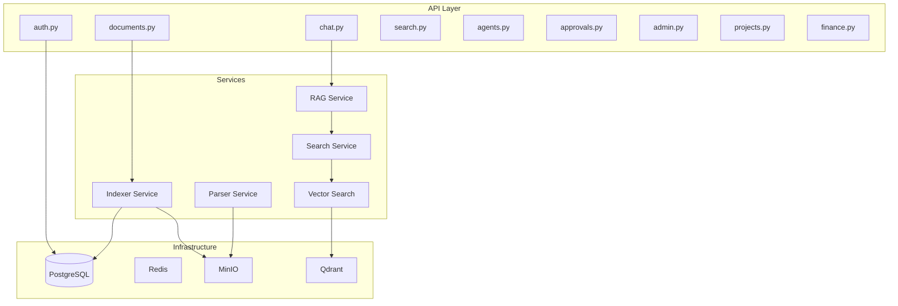
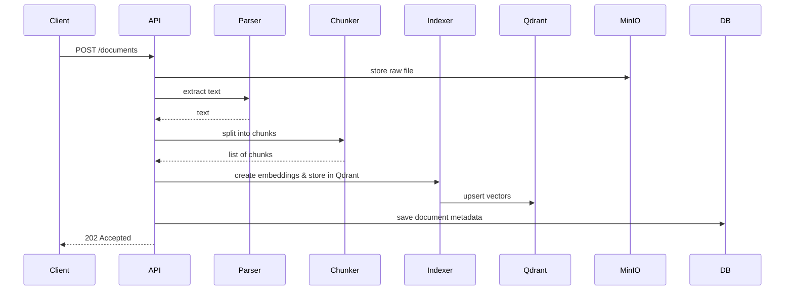
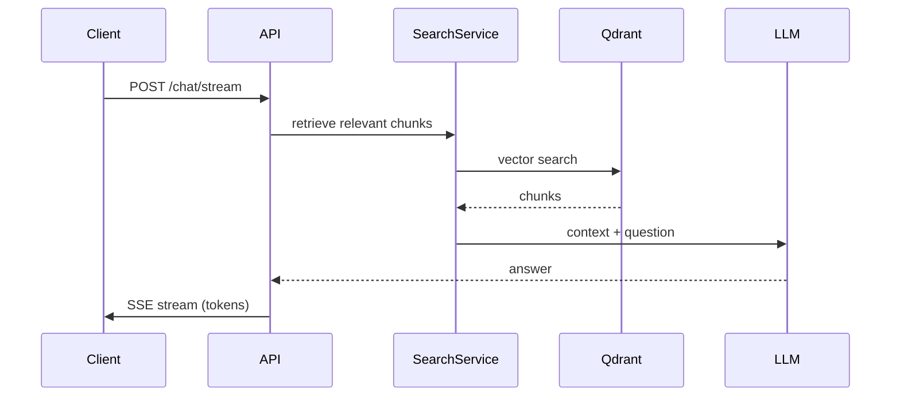

# Co-Op Backend API

FastAPI application serving the Co-Op OS backend. Includes asynchronous endpoints, RAG pipeline, agent workflows, and event-driven document processing.

## Table of Contents

- [Overview](#overview)
- [Architecture](#architecture)
- [Authentication & Authorization](#authentication--authorization)
- [API Endpoints](#api-endpoints)
- [RAG Pipeline](#rag-pipeline)
- [Background Processing](#background-processing)
- [Configuration](#configuration)
- [Testing](#testing)
- [Development](#development)

## Overview

The Co-Op backend is a production-ready FastAPI application featuring:

- **FastAPI 0.115+** with async/await throughout
- **SQLAlchemy 2.0** async ORM with PostgreSQL 16
- **Pydantic V2** for data validation and settings
- **LangGraph** for AI agent workflows
- **ARQ** (asyncio Redis Queue) for background tasks
- **Server-Sent Events (SSE)** for real-time chat streaming
- **JWT authentication** with bcrypt password hashing
- **Hybrid search** (BM25 + dense vectors + reranking)

### Technology Stack

- **Framework:** FastAPI 0.115.12
- **ORM:** SQLAlchemy 2.0.36 (async)
- **Database:** PostgreSQL 16 (via asyncpg)
- **Validation:** Pydantic 2.10.6
- **AI/ML:** LangGraph, LangChain, sentence-transformers
- **Search:** Qdrant (vector database), BM25 (lexical)
- **Storage:** MinIO (S3-compatible object storage)
- **Cache:** Redis 7.2
- **Task Queue:** ARQ (async Redis queue)
- **Testing:** pytest 8.3.4, pytest-asyncio, pytest-cov

## Architecture

### System Architecture Diagram



### Directory Structure

```
services/api/
├── app/
│   ├── routers/           # API endpoints
│   │   ├── auth.py        # Authentication (login, token)
│   │   ├── chat.py        # Chat streaming (SSE)
│   │   ├── documents.py   # Document upload/management
│   │   ├── search.py      # Hybrid search
│   │   ├── agents.py      # Agent monitoring
│   │   ├── approvals.py   # HITL approval queue
│   │   ├── admin.py       # Admin endpoints
│   │   ├── projects.py    # Project management
│   │   └── finance.py     # Financial tracking
│   ├── core/              # Core services
│   │   ├── parser.py      # Document parsing
│   │   ├── chunker.py     # Text chunking
│   │   ├── embedder.py    # Embedding generation
│   │   ├── indexer.py     # Vector indexing
│   │   └── search.py      # Search services
│   ├── models/            # SQLAlchemy models
│   ├── schemas/           # Pydantic schemas
│   ├── crons/             # Scheduled tasks
│   ├── config.py          # Configuration
│   └── main.py            # FastAPI app
├── tests/                 # Test suite
├── alembic/               # Database migrations
├── pyproject.toml         # Dependencies
└── README.md              # This file
```

## Authentication & Authorization

### JWT Authentication

- **Access tokens**: Short-lived (15 minutes), used for API requests
- **Refresh tokens**: Long-lived (7 days), used to obtain new access tokens
- **Algorithm**: HS256 (HMAC with SHA-256)
- **Secret**: Configured via `SECRET_KEY` environment variable

### Password Security

- **Hashing**: bcrypt with cost factor 12
- **Pre-hashing**: SHA256 applied before bcrypt to handle passwords >72 bytes
- **Salt**: Automatically generated per password

### Roles

- **admin**: Full access to all endpoints, user management
- **user**: Standard access, cannot manage other users

### Protected Routes

Most endpoints require authentication. Include the JWT token in the `Authorization` header:

```
Authorization: Bearer <access_token>
```

## API Endpoints

All endpoints are prefixed with `/v1`. FastAPI auto-generates interactive documentation at `/docs` (Swagger UI) and `/redoc` (ReDoc).

### Authentication

| Method | Path | Description |
|--------|------|-------------|
| POST | `/v1/auth/token` | Obtain access token (password grant) |
| POST | `/v1/auth/refresh` | Refresh access token |
| POST | `/v1/auth/register` | Register new user |
| GET | `/v1/auth/me` | Get current user info |

### Chat

| Method | Path | Description |
|--------|------|-------------|
| POST | `/v1/chat/stream` | Stream chat response (SSE) |
| GET | `/v1/conversations` | List user's conversations |
| GET | `/v1/conversations/{id}` | Get conversation details |
| DELETE | `/v1/conversations/{id}` | Delete conversation |

### Documents

| Method | Path | Description |
|--------|------|-------------|
| POST | `/v1/documents` | Upload a document |
| GET | `/v1/documents` | List user's documents |
| GET | `/v1/documents/{id}` | Get document details |
| DELETE | `/v1/documents/{id}` | Delete document |

### Search

| Method | Path | Description |
|--------|------|-------------|
| GET | `/v1/search` | Hybrid search across documents |

### Agents

| Method | Path | Description |
|--------|------|-------------|
| GET | `/v1/agents` | List AI agents and their status |
| GET | `/v1/agents/{id}/logs` | Get agent execution logs |

### Approvals

| Method | Path | Description |
|--------|------|-------------|
| GET | `/v1/approvals` | List pending HITL actions |
| POST | `/v1/approvals/{id}/approve` | Approve an action |
| POST | `/v1/approvals/{id}/reject` | Reject an action |

### Health

| Method | Path | Description |
|--------|------|-------------|
| GET | `/health` | Service health check |
| GET | `/ready` | Readiness probe |

## RAG Pipeline

### Document Processing Flow



### Pipeline Stages

1. **Upload**: Client uploads file via multipart/form-data
2. **Storage**: Raw file stored in MinIO
3. **Parsing**: Text extracted from PDF, DOCX, TXT, etc.
4. **Chunking**: Text split into overlapping chunks (512 tokens, 50 token overlap)
5. **Embedding**: Each chunk embedded using sentence-transformers
6. **Indexing**: Vectors stored in Qdrant with metadata
7. **Status Update**: Document status set to `READY`

### Search Flow



### Hybrid Search

Combines three search methods:

1. **BM25 (lexical)**: Keyword-based search
2. **Dense vectors**: Semantic similarity via embeddings
3. **Reranking**: Cross-encoder reranks top results

## Background Processing

### ARQ (Asyncio Redis Queue)

Long-running tasks are offloaded to background workers:

- Document indexing
- Lead scoring
- Proposal generation
- Email sending

### Worker Configuration

Workers are started alongside the API server via supervisord or separate processes.

```bash
# Start worker
arq app.worker.WorkerSettings
```

### Task Example

```python
from arq import create_pool
from arq.connections import RedisSettings

async def index_document(ctx, document_id: str):
    # Process document
    pass

class WorkerSettings:
    functions = [index_document]
    redis_settings = RedisSettings()
```

## Configuration

Settings are managed via Pydantic in `app/config.py`. Environment variables override defaults.

### Key Environment Variables

| Variable | Description | Default |
|----------|-------------|---------|
| `SECRET_KEY` | JWT signing secret | (required) |
| `POSTGRES_HOST` | PostgreSQL host | `localhost` |
| `POSTGRES_PORT` | PostgreSQL port | `5432` |
| `POSTGRES_USER` | Database user | `coop` |
| `POSTGRES_PASSWORD` | Database password | (required) |
| `POSTGRES_DB` | Database name | `coop_os` |
| `REDIS_HOST` | Redis host | `localhost` |
| `REDIS_PORT` | Redis port | `6379` |
| `MINIO_ENDPOINT` | MinIO endpoint | `localhost:9000` |
| `MINIO_ACCESS_KEY` | MinIO access key | `minioadmin` |
| `MINIO_SECRET_KEY` | MinIO secret key | `minioadmin` |
| `QDRANT_HOST` | Qdrant host | `localhost` |
| `QDRANT_PORT` | Qdrant port | `6333` |
| `LITELLM_URL` | LiteLLM proxy URL | `http://localhost:4000` |

See `.env.example` for the full list.

## Testing

### Running Tests

```bash
# Run all tests
pytest

# Run with coverage
pytest --cov=app --cov-report=term

# Run specific test file
pytest tests/test_auth.py

# Run with verbose output
pytest -v

# Run property-based tests
pytest tests/test_properties.py
```

### Test Coverage

Current coverage: **74%** (target: 80%)

Coverage reports are generated in `htmlcov/` directory.

### Test Structure

- **Unit tests**: Test individual functions and classes
- **Integration tests**: Test complete workflows (RAG pipeline, auth flow)
- **Property tests**: Test invariants using Hypothesis

### Writing Tests

Example test:

```python
import pytest
from httpx import AsyncClient

@pytest.mark.asyncio
async def test_login(async_client: AsyncClient):
    response = await async_client.post(
        "/v1/auth/token",
        data={"username": "test@example.com", "password": "password"}
    )
    assert response.status_code == 200
    assert "access_token" in response.json()
```

## Development

### Setup

```bash
# Install dependencies
pip install -e .

# Or with uv
uv pip install -e .

# Run migrations
alembic upgrade head

# Start development server
uvicorn app.main:app --reload --host 0.0.0.0 --port 8000
```

### Code Style

- **Linting**: Ruff
- **Formatting**: Ruff format
- **Type checking**: Pyright (optional)

```bash
# Run linter
ruff check .

# Auto-fix issues
ruff check --fix .

# Format code
ruff format .
```

### API Documentation

Interactive API docs are available at:
- Swagger UI: `http://localhost:8000/docs`
- ReDoc: `http://localhost:8000/redoc`
- OpenAPI JSON: `http://localhost:8000/openapi.json`

## Related Documentation

- [Database Schema](../../docs/DATABASE.md)
- [Docker Infrastructure](../../infrastructure/docker/README.md)
- [Testing Guide](../../docs/TESTING.md)
- [Security Practices](../../docs/SECURITY.md)
